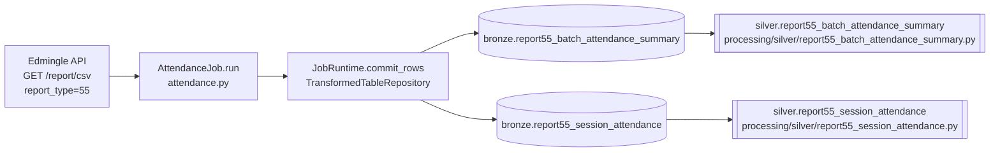

# Attendance Job

## 1. Overview

The `attendance` job (class `AttendanceJob`, module `api_scripts/attendance/attendance.py`) is a
port of a standalone legacy production script named `attendance.py` (referenced internally as
v1.2.0, "Production-grade Edmingle report_type=55 attendance pipeline"). It pulls Edmingle's
`report_type=55` attendance export one IST calendar day at a time, then reproduces that legacy
script's pandas-based transform layer to compute per-session and per-batch attendance summaries,
writing the results into two dedicated PostgreSQL Bronze tables instead of the legacy script's CSV
output.

**Status: this job is currently DISABLED and has never been run against the live Edmingle API.**
It is fully coded and registered in the job registry, but `is_enabled` is `false` in
`system.api_scripts`, in `system.pipelines`, and in `services/scheduler/jobs.example.yaml`, and no
scheduler process is deployed on the VPS (verified directly — see Section 17). Both target Bronze
tables (`bronze.report55_batch_attendance_summary`, `bronze.report55_session_attendance`) contain
**0 rows** in the live database (verified by direct query on 2026-09-24).

## 2. Purpose

To collect batch/session-level attendance data from Edmingle (report_type=55) for a configurable
date window, and produce two analytical outputs:

- A per-session record of who was marked present/absent/late and whether the session was actually
  conducted (`bronze.report55_session_attendance`).
- A per-batch, per-window rollup of attendance/retention/rating metrics computed from that batch's
  full session history within the window (`bronze.report55_batch_attendance_summary`).

This supports downstream attendance and retention reporting without operators having to work from
raw per-mark CSV exports.

## 3. High-Level Data Flow



Both Silver transforms exist in `processing/silver/` and are single-source (no reconciliation with
other tables). Per `system.pipelines`, the corresponding Silver pipelines
(`silver_report55_batch_attendance_summary`, `silver_report55_session_attendance`) are also
`is_enabled = false`.

## 4. Project / Repository Structure

```
api_scripts/attendance/
├── __init__.py            # "Date-windowed Edmingle attendance job."
├── attendance.py          # AttendanceJob class + all fetch/clean/transform/row-builder helpers
└── README.md              # Detailed porting notes and deviations from the legacy script

api_scripts/common/
├── models.py               # RawRecord, JobStats, canonical_json/payload_sha256/stable_record_key
├── runtime.py               # JobRuntime (commit / commit_rows)
├── api_client.py            # EdmingleApiClient (retry/backoff/rate-limit)
├── repositories.py          # BronzeRepository, CheckpointRepository, RunRepository, TransformedTableRepository
└── edmingle.py               # require_record_list, find_record_list, flatten_master_batches, has_more_pages

api_scripts/runner.py        # job_registry(), run_job() — CLI entry point
shared/config/settings.py    # DatabaseSettings, WarehouseSettings, EdmingleSettings
processing/silver/report55_batch_attendance_summary.py   # Silver transform for the summary table
processing/silver/report55_session_attendance.py          # Silver transform for the session table
services/scheduler/jobs.example.yaml                       # Scheduler entry (is_enabled: false)
```

## 5. Source System

| Source | Type | Endpoint | HTTP Method | Authentication | Parameters | Pagination | Rate Limit |
|---|---|---|---|---|---|---|---|
| Edmingle | REST/JSON (report export) | `/report/csv` | GET | `apikey` + `ORGID` headers (attached by `EdmingleApiClient`'s session); this job additionally passes `apikey`, `ORGID`, `organization_id` as query params | `report_type=55`, `organization_id`, `start_time`/`end_time` (IST-day-boundary epoch seconds), `response_type=1` | None — one request per IST calendar day in the window (no page/cursor params for this endpoint) | Enforced client-side via `EDMINGLE_MIN_REQUEST_INTERVAL_SECONDS` (default 2.5s) in `EdmingleApiClient._rate_limit()`; no server-side rate-limit contract is documented in code |

## 6. Extraction Process

1. `_collection_window()` resolves a `(start_date, end_date)` pair from
   `ATTENDANCE_START_DATE` / `ATTENDANCE_END_DATE` / `ATTENDANCE_LOOKBACK_DAYS` (default:
   yesterday in IST, 1-day lookback).
2. `_fetch_window()` loops one IST calendar day at a time from `start_date` to `end_date`
   inclusive. For each day it computes IST midnight-to-midnight epoch boundaries and calls
   `runtime.client.get_json("/report/csv", params=..., context=...)`.
3. `EdmingleApiClient.get_json()` (shared, `api_scripts/common/api_client.py`) performs the actual
   HTTP GET with retry/backoff: transient network errors and HTTP 429/5xx are retried up to
   `EDMINGLE_MAX_RETRIES` (default 4) with exponential backoff + jitter (`Retry-After` respected
   for 429); HTTP 400/401/403/404 raise immediately (`ApiRequestError`); Edmingle's own in-body
   error codes `6001`/`6002` are raised as `ApiRequestError` even on HTTP 200.
4. Each day's response is validated via `require_record_list(payload, "data", ...)`
   (`api_scripts/common/edmingle.py`) and, if non-empty, converted to a `pandas.DataFrame` and
   appended to a list of per-day frames.
5. All per-day frames are concatenated into one raw `DataFrame` for the whole window before any
   cleaning/summarization happens.

No pagination is applied to `/report/csv` itself; the "pagination" that exists is a client-side
day-by-day loop over the requested window, not an API-provided page cursor.

## 7. Detailed Function Documentation

### `class AttendanceJob`
- `name = "attendance"`, `checkpoint_partition_key = "daily"`.
- `run(self, runtime: JobRuntime, checkpoint: dict) -> None`: orchestrates the whole job —
  resolves the window, fetches, cleans, validates, summarizes, and commits both tables. If
  `start_date > end_date` (an empty/invalid window) it returns immediately without any writes,
  leaving `runtime.last_checkpoint = checkpoint` unchanged. If the fetch returns zero rows for the
  entire window, it still issues empty `commit_rows(..., rows=[])` calls for both tables so a
  checkpoint is still recorded for that (empty) run.

### Fetch helpers
- `_fetch_window(runtime, start_date, end_date) -> list[pd.DataFrame]`: the per-day fetch loop
  described in Section 6.
- `_collection_window() -> tuple[date, date]`: resolves the window from env vars; raises
  `ValueError` if `ATTENDANCE_LOOKBACK_DAYS` is outside `1..3650`.
- `_optional_date(name) -> date | None`: parses an optional `YYYY-MM-DD` env var.
- `_window_checkpoint(start_date, end_date) -> dict`: builds the checkpoint payload
  `{"summary_window_start", "summary_window_end", "updated_at"}`.

### Config accessors
- `_active_status_values()`, `_present_value()`, `_absent_value()`, `_late_value()`,
  `_treat_zero_rating_as_missing()` — read the corresponding `ATTENDANCE_*` env vars with defaults
  (see Section 8).

### Clean / validate
- `_resolve_session_id_column(df) -> str`: uses `ATTENDANCE_SESSION_ID_COLUMN` (default
  `attendance_id`) if present in the response; otherwise falls back to `class_Id` with a logged
  warning that session counts will be **undercounted** (`class_Id` is a subject/stream identifier,
  not a true session id).
- `_filter_active_students(df) -> pd.DataFrame`: keeps only rows whose `studentBatchStatus` is in
  the `ATTENDANCE_ACTIVE_STATUS_VALUES` allow-list (default `["Active"]`); logs a warning and
  passes all rows through unfiltered if the column is missing.
- `_clean_data(df, session_col) -> pd.DataFrame`: parses `classDate` (`%d %b %Y`, dropping
  unparseable rows), drops exact duplicate rows, drops rows missing `batch_Id`/`student_Id`/the
  session column, logs (without resolving) any `(student_Id, session)` pair with more than one row
  after dedup, applies the active-student filter, and derives `_class_datetime` from `classDate` +
  `startTime` (`%I:%M %p`).
- `_validate_present_value(df) -> None`: raises `ValueError` if the configured
  `ATTENDANCE_PRESENT_VALUE` never appears in `studentAttendanceStatus` for the fetched window —
  a guard against every attendance metric silently computing to zero.

### Summary computation
- `_build_class_summary(df, session_col) -> pd.DataFrame`: groups by `(batch_Id, session_col)` to
  compute `present_count`/`absent_count`/`late_count`/`total_marked` (each a `nunique(student_Id)`
  over rows matching the relevant status), `is_conducted` (`classDate <= today` IST),
  `session_number` (cumulative count per `batch_Id`, ordered chronologically), and
  `session_attendance_percentage` (`present_count / total_marked * 100`, rounded to 2 dp).
- `_compute_batch_summary(df, cs, session_col) -> pd.DataFrame`: aggregates the per-session summary
  up to one row per `batch_Id` — enrolled-student count, present/absent mark totals (over
  conducted sessions only), first/last class date and attendance, attendance/retention
  percentages, average/highest/lowest class attendance, and average rating (see Section 9 for the
  exact formulas).

### Row builders
- `_scalar(value)`: converts a pandas/numpy scalar to a plain Python value for psycopg2 (NaN/NaT/
  `pd.NA` → `None`; `pd.Timestamp` → `.date()`; numpy int/float/bool → native Python types).
- `_text(value)`: `_scalar` plus a cast to `str` (or `None`).
- `_session_rows(cs, session_col) -> list[tuple]`: builds the row tuples for
  `bronze.report55_session_attendance` in `SESSION_COLUMNS` order.
- `_batch_summary_rows(summary, start_date, end_date) -> list[tuple]`: builds the row tuples for
  `bronze.report55_batch_attendance_summary` in `BATCH_SUMMARY_COLUMNS` order, appending the
  window's `start_date`/`end_date` as `summary_window_start`/`summary_window_end`.

## 8. Input Parameters & Configuration

Job-specific environment variables (all read directly via `os.getenv` inside `attendance.py`, not
through `shared/config/settings.py`):

| Env var | Default | Notes |
|---|---|---|
| `ATTENDANCE_START_DATE` | unset | Explicit window start (`YYYY-MM-DD`); takes precedence over lookback. |
| `ATTENDANCE_END_DATE` | yesterday (IST) | Explicit window end (`YYYY-MM-DD`). |
| `ATTENDANCE_LOOKBACK_DAYS` | `1` | Used only when `ATTENDANCE_START_DATE` is unset. Must be 1–3650 or `ValueError` is raised. |
| `ATTENDANCE_ACTIVE_STATUS_VALUES` | `Active` | Comma-separated allow-list for `studentBatchStatus`. |
| `ATTENDANCE_SESSION_ID_COLUMN` | `attendance_id` | Falls back to `class_Id` (undercounts sessions) with a logged warning if absent from the response. |
| `ATTENDANCE_PRESENT_VALUE` | `P` | Value of `studentAttendanceStatus` meaning "present"; validated to actually occur in the fetched window. |
| `ATTENDANCE_ABSENT_VALUE` | `A` | Value meaning "absent". |
| `ATTENDANCE_LATE_VALUE` | `L` | Value meaning "late". |
| `ATTENDANCE_TREAT_ZERO_RATING_AS_MISSING` | `true` | Treats `studentRating == 0` as missing (Edmingle's "not rated" sentinel) rather than a real zero before averaging. |

Shared settings loaded via `shared/config/settings.py` (no secret values reproduced here — only
variable names):

- `EdmingleSettings.from_environment()`: `EDMINGLE_API_BASE_URL`, `EDMINGLE_API_KEY`,
  `EDMINGLE_API_KEY_EXPIRES_AT`, `EDMINGLE_API_KEY_STOP_DAYS_BEFORE_EXPIRY`,
  `EDMINGLE_ORGANIZATION_ID`, `EDMINGLE_INSTITUTE_ID` (not required by this job),
  `EDMINGLE_REQUEST_TIMEOUT_SECONDS`, `EDMINGLE_MAX_RETRIES`,
  `EDMINGLE_MIN_REQUEST_INTERVAL_SECONDS`, `EDMINGLE_INITIAL_RETRY_DELAY_SECONDS`,
  `EDMINGLE_MAXIMUM_RETRY_DELAY_SECONDS`.
- `DatabaseSettings.from_environment()`: `WAREHOUSE_DB_HOST`, `WAREHOUSE_DB_PORT`,
  `WAREHOUSE_DB_NAME`, `WAREHOUSE_DB_USER`, `WAREHOUSE_DB_PASSWORD`, `WAREHOUSE_DB_SSLMODE`,
  `WAREHOUSE_DB_CONNECT_TIMEOUT_SECONDS`, `WAREHOUSE_DB_STATEMENT_TIMEOUT_MS`,
  `WAREHOUSE_DB_POOL_MIN_CONNECTIONS`, `WAREHOUSE_DB_POOL_MAX_CONNECTIONS`.
- `WarehouseSettings.from_environment()`: `WAREHOUSE_ENVIRONMENT`, `WAREHOUSE_LOG_LEVEL`,
  `WAREHOUSE_DATA_DIRECTORY`, `WAREHOUSE_LOG_DIRECTORY`, `WAREHOUSE_MIN_FREE_DISK_MB`,
  `WAREHOUSE_SCHEDULER_ENABLED`, `WAREHOUSE_SCHEDULER_CONFIG`.

No actual `.env` values were read or printed as part of producing this document.

## 9. Data Transformation

This job's transform layer mirrors the legacy script's pandas pipeline exactly, per its own inline
comments:

- **Session-level (`_build_class_summary`)**: for each `(batch_Id, session)`, `present_count` /
  `absent_count` / `late_count` are the count of *distinct* students (`nunique`) whose
  `studentAttendanceStatus` equals the configured present/absent/late value; `total_marked` is the
  distinct-student count for any of `[present, absent, late, "E", "OL", "NA"]` (excludes Edmingle's
  `"-"` not-marked placeholder). `session_attendance_percentage = present_count / total_marked *
  100`, rounded to 2 decimals — the code computes this via
  `total_marked.replace(0, np.nan)` before dividing, so a session with `total_marked == 0` yields
  `NaN` → `NULL` in Postgres (via `_scalar`), **not** `0`.

  **Documentation discrepancy — requires confirmation.** The job's own `README.md` states this was
  deliberately changed to *pin the value to `0`* when `total_marked == 0` ("this port pins
  `session_attendance_percentage` to `0`... per this porting task's spec"), and flags the
  legacy script's original NULL-on-zero behavior as a possible point of confusion. The **code as
  currently written** (`total_marked.replace(0, np.nan)`) still produces `NULL`, not `0`, in that
  edge case — matching the legacy script's original behavior, not the README's stated deviation.
  This mismatch between the README and the executable code was observed directly during this audit
  and has not been resolved here; the project owner should confirm which behavior is intended and
  correct whichever of the two (code or README) is wrong.

- **Batch-level (`_compute_batch_summary`)**: `total_students_enrolled` = distinct students across
  all fetched rows for the batch; `total_present_marks`/`total_absent_marks` = sum of per-session
  `present_count`/`absent_count` over **conducted** sessions only (a mark-count, not a
  unique-student count); `first_class_date` = min `classDate` over all sessions,
  `last_class_date` = max `classDate` over conducted sessions only; `attendance_percentage` =
  mean(`present_count` over all sessions) / `total_students_enrolled` * 100;
  `average_class_attendance`/`highest_class_attendance`/`lowest_class_attendance` = mean/max/min
  of `present_count` over conducted sessions; `average_rating` = mean of `studentRating` (coerced
  numeric, with exact-zero treated as missing when `ATTENDANCE_TREAT_ZERO_RATING_AS_MISSING` is
  true); `retention_percentage` = `last_class_attendance / first_class_attendance * 100` (±inf →
  `NULL`); `attendance_drop` = `first_class_attendance - last_class_attendance`.
- `total_classes_planned` / `total_classes_conducted` / `total_classes_remaining` are computed
  internally but **not persisted** — they have no corresponding columns in
  `bronze.report55_batch_attendance_summary`.
- **No incremental merge.** This is a **full-window recompute**: every run recomputes both
  tables' rows from scratch for whatever window it resolves; it does not merge with a previous
  run's output, and does not resume `start_date` from the checkpoint.

## 10. Output Dataset

Two Bronze tables, both written via `JobRuntime.commit_rows()` →
`TransformedTableRepository.write_with_checkpoint()`:

- `bronze.report55_batch_attendance_summary` — one row per `(batch_id, summary_window_start,
  summary_window_end)`.
- `bronze.report55_session_attendance` — one row per `(batch_id, session_id)`.

Session rows are committed in chunks of `SESSION_COMMIT_CHUNK_SIZE = 2000` rows per
`commit_rows()` call (a long date range can produce many thousands of rows); batch summary rows
are committed in a single call since the whole window must be in memory to compute the aggregates.

## 11. Output Schema

`bronze.report55_batch_attendance_summary` (confirmed live via `\d`, 2026-09-24):

| Column | Data Type | Description | Source/Derived |
|---|---|---|---|
| id | bigint (identity) | Surrogate key | Generated by Postgres |
| pipeline_run_id | uuid, not null | FK to `audit.pipeline_runs.id` | Set by `TransformedTableRepository` |
| batch_id | text, not null | Edmingle batch id | `batch_Id` |
| batch_name | text | Batch display name | `batchName` |
| bundle_id | text | Course bundle id | `bundle_Id` |
| bundle_name | text | Course bundle name | `bundleName` |
| course_id | text | Course id | `course_Id` |
| course_name | text | Course name | `courseName` |
| teacher_id | text | Teacher id | `teacher_Id` |
| teacher_name | text | Teacher name | `teacherName` |
| total_students_enrolled | numeric | Distinct students for the batch | Derived (`nunique(student_Id)`) |
| first_class_date | date | Earliest session date (all sessions) | Derived |
| last_class_date | date | Latest conducted session date | Derived |
| first_class_attendance | numeric | `present_count` of first session | Derived |
| last_class_attendance | numeric | `present_count` of last conducted session (0 if missing) | Derived |
| total_present_marks | numeric | Sum of present marks, conducted sessions | Derived |
| total_absent_marks | numeric | Sum of absent marks, conducted sessions | Derived |
| attendance_percentage | numeric | Mean present / enrolled * 100 | Derived |
| average_class_attendance | numeric | Mean present, conducted sessions | Derived |
| highest_class_attendance | numeric | Max present, conducted sessions | Derived |
| lowest_class_attendance | numeric | Min present, conducted sessions | Derived |
| average_rating | numeric | Mean `studentRating` (0 excluded by default) | Derived |
| retention_percentage | numeric | `last/first_class_attendance * 100` | Derived |
| attendance_drop | numeric | `first - last_class_attendance` | Derived |
| summary_window_start | date, not null | Requested window start | Job input (env/default) |
| summary_window_end | date, not null | Requested window end | Job input (env/default) |
| received_at | timestamptz, not null | Row ingestion time | Set by `TransformedTableRepository` |
| created_at | timestamptz, not null, default now() | Row creation time | Postgres default |

Unique constraint: `(batch_id, summary_window_start, summary_window_end)`.

`bronze.report55_session_attendance` (confirmed live via `\d`, 2026-09-24):

| Column | Data Type | Description | Source/Derived |
|---|---|---|---|
| id | bigint (identity) | Surrogate key | Generated by Postgres |
| pipeline_run_id | uuid, not null | FK to `audit.pipeline_runs.id` | Set by `TransformedTableRepository` |
| batch_id | text, not null | Edmingle batch id | `batch_Id` |
| batch_name | text | Batch display name | `batchName` |
| course_id | text | Course id | `course_Id` |
| course_name | text | Course name | `courseName` |
| session_number | integer | Cumulative session order per batch | Derived |
| session_id | text, not null | Resolved session id column value | `attendance_id` or `class_Id` fallback |
| class_date | date | Session date | `classDate` |
| is_session_conducted | boolean | `classDate <= today` (IST) | Derived |
| present_count | numeric | Distinct present students | Derived |
| absent_count | numeric | Distinct absent students | Derived |
| late_count | numeric | Distinct late students | Derived |
| total_marked | numeric | Distinct students with any real status | Derived |
| session_attendance_percentage | numeric | `present/total_marked*100` | Derived (see Section 9 discrepancy) |
| received_at | timestamptz, not null | Row ingestion time | Set by `TransformedTableRepository` |
| created_at | timestamptz, not null, default now() | Row creation time | Postgres default |

Unique constraint: `(batch_id, session_id)`.

## 12. Data Quality & Validation

- **Present-value sanity guard** (`_validate_present_value`): raises `ValueError` if the
  configured present-status value never occurs in the fetched window, preventing a silent
  all-zero result.
- **Unparseable dates dropped**: rows with a `classDate` that fails to parse against
  `%d %b %Y` are dropped with a logged warning and count.
- **Exact duplicate rows dropped**, with a logged count.
- **Rows missing key columns dropped** (`batch_Id`, `student_Id`, resolved session column), with
  a logged count.
- **Conflicting (student, session) pairs are logged but not auto-resolved** — all such rows are
  kept as-is; this is a known, intentional gap (see Section 21).
- **Active-student filter**: uses an allow-list, not a block-list, so unrecognized
  `studentBatchStatus` values are excluded by default rather than silently counted.
- No row-level rejection into `bronze.rejected_records` is performed by this job — it relies on
  in-memory `pandas` filtering rather than the generic `BronzeRepository` rejection path.

## 13. Error Handling & Logging

- All HTTP-layer errors (timeouts, connection errors, non-2xx/429/5xx, invalid JSON, or
  Edmingle in-body error codes 6001/6002) are raised by `EdmingleApiClient.get_json()` as
  `ApiRequestError` or `ApiContractError` (`api_scripts/common/api_client.py`); the job itself
  does not catch these, so any unrecoverable API failure aborts the whole run.
- `runner.run_job()` wraps `job.run(...)` in a `try/except Exception`, records the run as `FAILED`
  in `audit.pipeline_runs` (via `RunRepository.finish(..., status="failed", error_category=type(exc).__name__)`),
  logs `"job failed"` with the exception's type name (not its message/stack), and returns exit
  code `1`. Full error detail is documented as living only in "protected application logs" — not
  in the audit table (see `RunRepository.finish`'s `error_message` SQL: it stores a fixed string,
  never the exception's text).
- Logger name: `warehouse.job.attendance` (module-level `LOGGER`). Key log points: rate-limit
  backoff warnings (from the shared client), quiet-day debug logs (0 rows for a given date),
  dropped-row warnings during cleaning, the present-value validation failure, and the final
  `"attendance: clean complete, %d row(s) ready for summarisation"` info log.

## 14. Dependencies

- Python: `pandas==2.2.3`, `numpy==2.1.3` (both pinned in `requirements.txt`).
- `psycopg2` (via `api_scripts/common/repositories.py`'s `execute_values`/`Json`).
- `requests` (via `EdmingleApiClient`).
- Internal: `api_scripts.common.edmingle.require_record_list`,
  `api_scripts.common.repositories.utc_iso`, `api_scripts.common.runtime.JobRuntime`.
- Upstream data dependency: none — this job's fetch does not depend on any other job's Bronze
  table (unlike `class_id_lookup`/`class_session_attendance`, which chain off `catalogue`).

## 15. Setup

1. Ensure `EDMINGLE_API_KEY`, `EDMINGLE_ORGANIZATION_ID`, and the `WAREHOUSE_DB_*` variables are
   set in the project's `.env` (values not reproduced here).
2. Ensure migrations up to and including `006_legacy_pipeline_bronze_tables.sql` (which creates
   `bronze.report55_batch_attendance_summary` and `bronze.report55_session_attendance`) have been
   applied — confirmed present on the live database as of this audit.
3. Optionally set `ATTENDANCE_START_DATE`/`ATTENDANCE_END_DATE` (or `ATTENDANCE_LOOKBACK_DAYS`)
   and any of the other `ATTENDANCE_*` overrides listed in Section 8.
4. Flip `is_enabled` to `true` for the `attendance` row in `system.api_scripts` and
   `system.pipelines`, and in `services/scheduler/jobs.example.yaml`, only when the project owner
   has explicitly authorized running this job against the live Edmingle API (see Section 17).

## 16. How to Run

```
docker compose run --rm warehouse-cli python warehouse_cli.py collect attendance
```

The registered job name is confirmed as the literal string `"attendance"` in
`api_scripts/runner.py::job_registry()`. A manual run can also set `--run-type`:

```
python -m api_scripts collect attendance --run-type manual
```
(the CLI's exact top-level invocation wrapper — `warehouse_cli.py` vs. `api_scripts/__main__.py`
— was not independently re-verified beyond `runner.py`'s own `argparse` definition; `runner.py`'s
`main()`/`parse_args()` accept `job` and `--run-type {manual,scheduled,replay}`.)

## 18. Database / Warehouse Integration

- **Checkpoint mechanism**: `system.collection_checkpoints`, keyed by `(job_name, partition_key)`
  — `job_name = "attendance"`, `partition_key = "daily"` (`AttendanceJob.checkpoint_partition_key`).
  Each `commit_rows()` call upserts the checkpoint JSON
  (`{"summary_window_start", "summary_window_end", "updated_at"}`) via
  `ON CONFLICT (job_name, partition_key) DO UPDATE`. As documented in the job's own README, this
  checkpoint is **informational only** for this job — because it is a full-window recompute job,
  the checkpoint is never read back to decide the next run's start date.
- **Audit trail**: `audit.pipeline_runs` — one row per invocation, created by
  `RunRepository.start()` (`status='RUNNING'`) and finalized by `RunRepository.finish()`
  (`status='SUCCESS'`/`'FAILED'`, with `rows_read`, `rows_written`, `rows_rejected`,
  `checkpoint_before`/`checkpoint_after`, `request_count` in `metadata`). `audit.events` gets a
  `job_started` row at start, a `checkpoint_committed` row per `commit_rows()` call, and a
  `job_finished`/`job_failed` row at the end.
- **Upsert behavior**: both tables use `INSERT ... ON CONFLICT (<unique_columns>) DO UPDATE SET
  <all non-key columns> = EXCLUDED.<column>` (built dynamically in
  `TransformedTableRepository.write_with_checkpoint`), so re-running the *same* window updates the
  existing row(s) in place rather than duplicating them.
- **Primary/unique keys**: `report55_batch_attendance_summary` — PK `id` (identity), unique
  `(batch_id, summary_window_start, summary_window_end)`. `report55_session_attendance` — PK `id`
  (identity), unique `(batch_id, session_id)`. Both have a `pipeline_run_id` FK to
  `audit.pipeline_runs.id`.

## 17. Automation / Scheduling

Confirmed directly from the live system:

- `services/scheduler/jobs.example.yaml` lists `attendance_daily` (`job_key: attendance`,
  `interval_minutes: 1440`) with `is_enabled: false`.
- `system.api_scripts` row `job_name = 'attendance'` has `is_enabled = false`.
- `system.pipelines` row `pipeline_name = 'attendance'` has `is_enabled = false`.
- The `warehouse-scheduler` service is defined in `docker-compose.yml` (image
  `ela-data-warehouse:latest`, command `python services/scheduler/runner.py`) but **no container
  for it is currently running** on the VPS — `docker ps -a` shows only
  `edmingle_webhook-replay-1`, `ela-data-warehouse-webhook`, `edmingle-webhook-replay`, and
  `edmingle-webhook` containers, none of which is `warehouse-scheduler`.

In short: even if the `is_enabled` flags were flipped to `true`, there is currently no running
scheduler process on this VPS to act on them — the job can only be triggered manually via
Section 16's command.

## 19. Data Lineage

```
Edmingle report_type=55 (/report/csv)
  → AttendanceJob (pandas transform)
    → bronze.report55_session_attendance
    → bronze.report55_batch_attendance_summary
      → silver.report55_session_attendance (processing/silver/report55_session_attendance.py)
      → silver.report55_batch_attendance_summary (processing/silver/report55_batch_attendance_summary.py)
        → Gold: Not identified in the current implementation.
```

## 20. Important Business / Technical Rules

- Full-window recompute, not incremental — see Section 9.
- Active-student allow-list filtering, not a block-list.
- `class_Id` fallback for the session id column undercounts sessions and is logged as a warning,
  not an error.
- `studentRating == 0` is treated as "not rated" by default (configurable).
- `total_classes_planned/conducted/remaining` are computed but intentionally not persisted,
  matching the legacy script's own CSV output columns.
- Batch-specific exclusion lists (like `catalogue`'s `_BATCH_IDS_TO_EXCLUDE`) do **not** apply to
  this job — `attendance.py` has no such list.

## 21. Known Limitations

### Confirmed limitations
- **This job is disabled and has 0 rows in production.** It has never been run against the live
  Edmingle API. `is_enabled = false` in `system.api_scripts`, `system.pipelines`, and
  `services/scheduler/jobs.example.yaml`; `bronze.report55_batch_attendance_summary` and
  `bronze.report55_session_attendance` both contain 0 rows (confirmed by direct query,
  2026-09-24). No scheduler container is deployed.
- The README's stated deviation ("pins `session_attendance_percentage` to `0`") does not match
  the actual code (`total_marked.replace(0, np.nan)`, which yields `NULL`) — see Section 9.
- Conflicting `(student_Id, session)` pairs after deduplication are logged but never
  auto-resolved; all conflicting rows are kept, which can double-count a student's attendance in
  edge cases.
- The checkpoint is written but functionally unused for resuming (full-window recompute design).

### Requires confirmation
- Whether `session_attendance_percentage` should be `NULL` or `0` when `total_marked == 0`
  (project owner should reconcile the README vs. the code — see Section 9).
- The exact `warehouse_cli.py` invocation path referenced in Section 16 was not independently
  traced end-to-end beyond `api_scripts/runner.py`.
- Gold-layer consumption of these two tables: not identified in the current implementation.

## 22. Troubleshooting

| Symptom | Likely cause | Where to look |
|---|---|---|
| `ValueError: ATTENDANCE_LOOKBACK_DAYS must be between 1 and 3650` | Misconfigured env var | `_collection_window()` |
| `ValueError: ATTENDANCE_PRESENT_VALUE=... not found in studentAttendanceStatus` | Wrong present-value config, or Edmingle changed its status vocabulary | `_validate_present_value()` |
| Job runs but both tables end up empty | Window resolved to 0 days, or `/report/csv` returned no rows for every day in range | `_fetch_window()` logs (`"quiet day"` debug lines) |
| `ApiRequestError ... exhausted retries after HTTP 429/5xx` | Edmingle rate limit or outage | `EdmingleApiClient.get_json()`; consider raising `EDMINGLE_MIN_REQUEST_INTERVAL_SECONDS` |
| Session counts look too low | `ATTENDANCE_SESSION_ID_COLUMN` fell back to `class_Id` | Check for the fallback warning log |
| `audit.pipeline_runs.error_message` unhelpful | By design — the message is a fixed string; real detail is only in application logs | See Section 13 |

## 23. Maintenance Guide

- Do not alter the fetch/transform logic without cross-checking the legacy `attendance.py` script
  referenced in the module docstring — the module explicitly warns against "fixing" or
  simplifying business logic without that check.
- If the `session_attendance_percentage` NULL-vs-0 discrepancy (Section 9/21) is resolved,
  update both the code and this document together.
- Keep `BATCH_SUMMARY_COLUMNS`/`SESSION_COLUMNS` order in `attendance.py` in sync with the actual
  column order consumed by `_batch_summary_rows`/`_session_rows` — the module comments call this
  out explicitly as a correctness requirement for `commit_rows()`.
- `SESSION_COMMIT_CHUNK_SIZE` (2000) can be tuned if a very large date range causes long-running
  transactions.

## 24. Upstream & Downstream Dependencies

- **Upstream**: Edmingle `/report/csv` (report_type=55) only. No dependency on any other job's
  Bronze table.
- **Downstream**: `processing/silver/report55_batch_attendance_summary.py` and
  `processing/silver/report55_session_attendance.py` each read directly from their respective
  Bronze table with no cross-table reconciliation. No Gold-layer consumer was identified in the
  current implementation.

## 25. Security Considerations

- `EDMINGLE_API_KEY` and `EDMINGLE_ORGANIZATION_ID` are read from environment variables only and
  attached as request headers by `EdmingleApiClient`; this document does not reproduce their
  values.
- `RunRepository.finish()` deliberately stores only a fixed placeholder string
  (`'job failed; inspect protected application logs'`) in `audit.error_message` rather than the
  raw exception text, to avoid leaking potentially sensitive request/response detail into the
  audit table.
- `ApiRequestError`'s own docstring states it "excludes response bodies and request URLs" by
  design.
- No PII beyond student/teacher identifiers and names is written to these two tables, per the
  confirmed live schema (Section 11).

## 26. Change Log

| Date | Author | Change |
|---|---|---|
| 2026-09-24 | | Initial version |

## 27. Ownership

Requires confirmation from the project owner.
