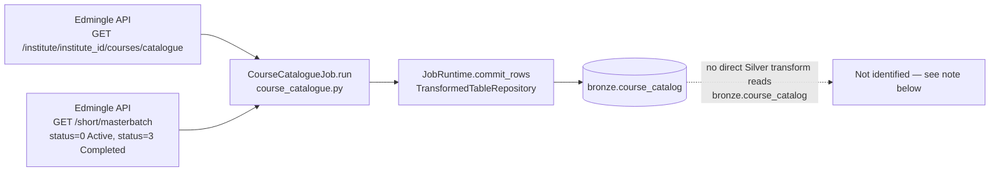

# Course Catalogue Job

## 1. Overview

The `attendance_data.catalogue` job (class `CourseCatalogueJob`, module
`api_scripts/attendance_data/catalogue/course_catalogue.py`) is a port of a legacy standalone
script named `build_course_catalog.py` — described in the module docstring as the **primary**
Stage-1 catalogue builder of a legacy multi-stage pipeline (there is a non-primary backup script,
`build_course_catalog_alt.py`, which this job does **not** port). It merges Edmingle's course
catalogue with Active/Completed batch data into a single per-batch (or per-catalogue-only-course)
row, written to `bronze.course_catalog`.

**Status: this job is currently DISABLED and has never been run against the live Edmingle API.**
It is fully coded and registered in the job registry, but `is_enabled` is `false` in
`system.api_scripts`, in `system.pipelines`, and in `services/scheduler/jobs.example.yaml`, and no
scheduler process is deployed on the VPS (verified directly — see Section 17).
`bronze.course_catalog` contains **0 rows** in the live database (verified by direct query on
2026-09-24).

## 2. Purpose

To produce a single, merged, full-refresh catalogue table that combines: (a) the raw institute
course catalogue, and (b) Active/Completed batch data for each course, with derived fields such as
`Is_Latest_Batch`, `bundle_enrollment_count`, and `Final_Status`. This is Stage 1 of a legacy
three-stage attendance pipeline that this job, `attendance_data.class_id_lookup`, and
`attendance_data.class_session_attendance` collectively port (see Section 24).

## 3. High-Level Data Flow



**Note on Silver correspondence.** `processing/silver/courses.py` builds `silver.courses`, but its
`_SELECT_SQL` reads from **`bronze.course_batch_merge`** only (a sibling job's table), explicitly
*not* `bronze.course_catalog`. The `courses.py` module docstring documents this as a deliberate
project-owner decision (migration `009_silver_courses.sql`): three Bronze tables
(`bronze.course_catalog`, `bronze.course_batch_merge`, `bronze.course_catalogue_raw`)
independently port the same catalogue/batch domain, and `course_batch_merge` was chosen as the
sole authoritative source for `silver.courses`. **There is no Silver transform for
`bronze.course_catalog` specifically** in `processing/silver/` as of this audit — this is stated
factually per the instruction not to invent one that doesn't exist.

## 4. Project / Repository Structure

```
api_scripts/attendance_data/catalogue/
├── __init__.py               # "Edmingle course-catalogue job."
├── course_catalogue.py        # CourseCatalogueJob class + fetch/transform/row-builder helpers
└── README.md                  # Porting notes, deviations, and known limitations

api_scripts/attendance_data/
├── __init__.py
└── README.md                  # Parent-package notes for the attendance_data.* job family

api_scripts/common/            # Shared framework (see attendance job's doc, Section 4, for detail)
api_scripts/runner.py          # job_registry(), run_job()
shared/config/settings.py      # DatabaseSettings, WarehouseSettings, EdmingleSettings
services/scheduler/jobs.example.yaml
```

## 5. Source System

| Source | Type | Endpoint | HTTP Method | Authentication | Parameters | Pagination | Rate Limit |
|---|---|---|---|---|---|---|---|
| Edmingle | REST/JSON | `/institute/{institute_id}/courses/catalogue` | GET | `apikey`+`ORGID` headers (session-level, via `EdmingleApiClient`) | `institution_id={institute_id}` | None — single call | Client-side `EDMINGLE_MIN_REQUEST_INTERVAL_SECONDS` |
| Edmingle | REST/JSON | `/short/masterbatch` | GET | `apikey`+`ORGID` headers | `status` (0=Active, 3=Completed), `page`, `per_page=1000`, `organization_id` | Page-number based; loop stops when a page returns fewer than `per_page` (1000) rows | Client-side `EDMINGLE_MIN_REQUEST_INTERVAL_SECONDS` |

## 6. Extraction Process

1. `run()` reads `EDMINGLE_INSTITUTE_ID` from `runtime.client.settings.institute_id` and raises
   `ValueError` immediately if it is unset — this job requires it (unlike `attendance`).
2. `_fetch_catalogue(runtime, institute_id)`: single `GET /institute/{institute_id}/courses/
   catalogue?institution_id={institute_id}` call. If the `response` key yields zero rows, raises
   `ApiContractError` ("aborting full refresh") — mirroring the legacy script's own
   "Catalogue fetch failed. Aborting." behavior.
3. `_fetch_batches(runtime, organization_id)`: for each of `{0: "Active", 3: "Completed"}`, loops
   pages of `GET /short/masterbatch?status={s}&page={n}&per_page=1000&organization_id={org_id}`
   until a page returns fewer than 1000 `courses` entries. **Status 1 (Archived) is never
   fetched** — this is intentional and specific to this job's source script (the sibling
   `course_batch_merge` job fetches all three statuses because its own source script needs the
   full history). Each course's `batch` array (or a `[{}]` placeholder if absent) is flattened
   into one row per batch, capturing `bundle_id`, `bundle_name`, `batch_id` (`class_id`),
   `batch_name` (`class_name`), `batch_status`, `start_date`, `end_date`, `tutor_name`,
   `tutor_id`, `batch_enrollment_count` (`admitted_students`, default 0). If no rows are
   collected across both statuses, raises `ApiContractError` ("aborting full refresh").

## 7. Detailed Function Documentation

### `class CourseCatalogueJob`
- `name = "attendance_data.catalogue"`, `checkpoint_partition_key = "default"`.
- `run(self, runtime, checkpoint) -> None`: orchestrates fetch → exclude → bundle-enrollment
  rollup → latest-batch marking → merge → business-logic derivation → add catalogue-only rows →
  date formatting → row build → `commit_rows()`. Full-refresh design: every run re-fetches and
  rewrites the entire table.

### Fetch
- `_fetch_catalogue(runtime, institute_id) -> pd.DataFrame` (Section 6).
- `_fetch_batches(runtime, organization_id) -> pd.DataFrame` (Section 6).

### Transform (ported 1:1 from the legacy script, per its own inline warning not to "fix" or
simplify without checking the original)
- `_is_excluded_batch_id(batch_id) -> bool` / `_filter_excluded_batches(df) -> pd.DataFrame`:
  drops rows whose `batch_id` is in the fixed set `_BATCH_IDS_TO_EXCLUDE` (20 hardcoded IDs:
  `12458, 12459, 12464, 12472, 12473, 12474, 12475, 12485, 12487, 12513, 12522, 12550, 12551,
  12554, 12606, 12607, 70572, 42632, 70587, 53438`). Applied before any other transform.
- `_compute_bundle_enrollment(df) -> pd.DataFrame`: adds `bundle_enrollment_count` = sum of
  `batch_enrollment_count` grouped by `bundle_id`.
- `_mark_latest_batch(df) -> pd.DataFrame`: sorts by `[bundle_id, start_date desc (NaN→0),
  batch_id desc]` and sets `Is_Latest_Batch = 1` on the first row of each bundle group, `0`
  otherwise.
- `_apply_business_logic(df) -> pd.DataFrame`: sets `Catalogue_Status` = raw catalogue `Status`;
  default `Final_Status = "Completed"` for every row; for the latest batch of a bundle, if the
  stripped catalogue `Status` is one of `{"Completed", "Ongoing", "Upcoming"}`, `Final_Status`
  takes that value, otherwise it is blanked to `""`.
- `_add_courses_without_batches(merged_df, cat_df) -> pd.DataFrame`: appends one synthetic row per
  catalogue bundle absent from the merged batch data (`Has_Batch=0`, `Is_Latest_Batch=1`,
  `bundle_enrollment_count=0`, `Catalogue_Match=1`), with all `_BATCH_ONLY_COLUMNS` (`batch_id`,
  `batch_name`, `batch_status`, `start_date`, `end_date`, `tutor_name`, `tutor_id`,
  `batch_enrollment_count`) set to `None`.
- `_format_dates(df) -> pd.DataFrame`: converts `start_date`/`end_date` from Unix epoch seconds to
  `date` objects.

### Row builders
- `_clean_text`, `_clean_numeric`, `_clean_bool`, `_clean_date`: NaN/None-safe casters.
- `_FIELD_MAP`: an ordered list of `(target Postgres column, source DataFrame column, caster)`
  tuples that defines both the INSERT column order and the row-tuple order — includes the
  documented API/legacy-script column-name typo `"Tutord Ids"` (source) mapped to
  `tutor_ids` (target).
- `_build_rows(df) -> list[tuple]`: applies `_FIELD_MAP` to every merged record.

## 8. Input Parameters & Configuration

This job has **no job-specific `ATTENDANCE_DATA_CATALOGUE_*` env vars** — all its behavior is
driven by fixed constants in code (`_BATCH_STATUSES`, `_BATCHES_PER_PAGE=1000`,
`_BATCH_IDS_TO_EXCLUDE`, `_VALID_CATALOGUE_STATUSES`) plus the shared settings:

- `EdmingleSettings.from_environment()`: `EDMINGLE_API_BASE_URL`, `EDMINGLE_API_KEY`,
  `EDMINGLE_API_KEY_EXPIRES_AT`, `EDMINGLE_API_KEY_STOP_DAYS_BEFORE_EXPIRY`,
  `EDMINGLE_ORGANIZATION_ID`, **`EDMINGLE_INSTITUTE_ID` (required by this job — raises
  `ValueError` if unset)**, `EDMINGLE_REQUEST_TIMEOUT_SECONDS`, `EDMINGLE_MAX_RETRIES`,
  `EDMINGLE_MIN_REQUEST_INTERVAL_SECONDS`, `EDMINGLE_INITIAL_RETRY_DELAY_SECONDS`,
  `EDMINGLE_MAXIMUM_RETRY_DELAY_SECONDS`.
- `DatabaseSettings.from_environment()`: `WAREHOUSE_DB_HOST`, `WAREHOUSE_DB_PORT`,
  `WAREHOUSE_DB_NAME`, `WAREHOUSE_DB_USER`, `WAREHOUSE_DB_PASSWORD`, `WAREHOUSE_DB_SSLMODE`,
  `WAREHOUSE_DB_CONNECT_TIMEOUT_SECONDS`, `WAREHOUSE_DB_STATEMENT_TIMEOUT_MS`,
  `WAREHOUSE_DB_POOL_MIN_CONNECTIONS`, `WAREHOUSE_DB_POOL_MAX_CONNECTIONS`.
- `WarehouseSettings.from_environment()`: `WAREHOUSE_ENVIRONMENT`, `WAREHOUSE_LOG_LEVEL`,
  `WAREHOUSE_DATA_DIRECTORY`, `WAREHOUSE_LOG_DIRECTORY`, `WAREHOUSE_MIN_FREE_DISK_MB`,
  `WAREHOUSE_SCHEDULER_ENABLED`, `WAREHOUSE_SCHEDULER_CONFIG`.

No actual `.env` values were read or printed as part of producing this document.

## 9. Data Transformation

See Section 7's "Transform" subsection for the exact rules. Summary of the merge logic:

1. Batch rows (Active + Completed, excluded-ID-filtered) are left-merged with the catalogue on
   `bundle_id` == `Bundle id`.
2. `Catalogue_Match = 1` if the bundle matched a catalogue row, else `0`.
3. `Final_Status` defaults to `"Completed"`; only the latest batch per bundle can override it to
   the catalogue's own `Status` (if that status is `Completed`/`Ongoing`/`Upcoming`), or to blank
   if the latest batch's status doesn't match any of those three or has no catalogue match.
4. Catalogue bundles with **no** batch at all get one synthetic row with batch-specific fields
   `NULL`.

This is a **full-refresh** job — like `attendance`, it does not merge with a prior run's output;
every run regenerates the whole table from a fresh fetch.

## 10. Output Dataset

`bronze.course_catalog`, written via a single `JobRuntime.commit_rows()` call per run
(`TransformedTableRepository`), upserting on `(batch_id, bundle_id)`.

## 11. Output Schema

Confirmed live via `\d bronze.course_catalog` (2026-09-24):

| Column | Data Type | Description | Source/Derived |
|---|---|---|---|
| id | bigint (identity) | Surrogate key | Generated by Postgres |
| pipeline_run_id | uuid, not null | FK to `audit.pipeline_runs.id` | Set by `TransformedTableRepository` |
| bundle_id | text | Course bundle id | `bundle_id` (batch source) |
| bundle_name | text | Course bundle name | `bundle_name` |
| batch_id | text | Batch id | `batch_id` (`class_id`); `NULL` for catalogue-only rows |
| batch_name | text | Batch name | `batch_name` (`class_name`) |
| batch_status | text | `Active`/`Completed` label | Derived from fetch status code |
| start_date | date | Batch start date | Unix epoch → date |
| end_date | date | Batch end date | Unix epoch → date |
| tutor_name | text | Tutor name | `tutor_name` |
| tutor_id | text | Tutor id | `tutor_id` |
| batch_enrollment_count | numeric | Admitted students for the batch | `admitted_students` (default 0) |
| course_name | text | Catalogue course name | `Course Name` |
| tutors | text | Catalogue tutors field | `Tutors` |
| tutor_ids | text | Catalogue tutor ids | `Tutord Ids` (source typo, confirmed in code) |
| course_ids | text | Catalogue course ids | `Course Ids` |
| subject | text | Subject | `Subject` |
| level | text | Level | `Level` |
| language | text | Language | `Language` |
| examination | text | Examination | `Examination` |
| course_type | text | Course type | `Type` |
| course_division | text | Course division | `Course Division` |
| certificate | text | Certificate flag/text | `Certificate` |
| course_sponsor | text | Sponsor | `Course Sponsor` |
| course_title_sanskrit | text | Sanskrit title | `Course Title Sanskrit` |
| catalogue_raw_status | text | Raw catalogue status | `Status` |
| number_of_lectures | text | Lecture count | `Number of Lectures` |
| duration | text | Duration | `Duration` |
| personas | text | Personas | `Personas` |
| computer_based_assessment | text | CBA flag/text | `Computer Based Assessment` |
| product_id | text | Product id | `Product ID` |
| sss_category | text | SSS category | `SSS Category` |
| viniyoga | text | Viniyoga | `Viniyoga` |
| adhyayanam_category | text | Adhyayanam category | `Adhyayanam Category` |
| term_of_course | text | Term of course | `Term of Course` |
| position_in_funnel | text | Funnel position | `Position in Funnel` |
| division | text | Division | `Division` |
| is_catalogue_match | boolean | Whether the batch matched a catalogue bundle | `Catalogue_Match` |
| bundle_enrollment_count | numeric | Sum of batch enrollments per bundle | Derived |
| is_latest_batch | boolean | Whether this is the bundle's latest batch | Derived |
| has_batch | boolean | Whether the row originated from a real batch | Derived (0/1) |
| catalogue_status | text | Mirror of raw catalogue `Status` | Derived |
| final_status | text | Business-rule-derived status | Derived |
| received_at | timestamptz, not null | Row ingestion time | Set by `TransformedTableRepository` |
| created_at | timestamptz, not null, default now() | Row creation time | Postgres default |

Unique constraint: `(batch_id, bundle_id)`.

## 12. Data Quality & Validation

- Both fetch functions raise `ApiContractError` (aborting the whole run) if they return zero rows
  — matching the legacy script's own "Aborting" behavior on empty catalogue/batch fetches.
- `_is_excluded_batch_id` guards against non-numeric `batch_id` values with a `try/except`,
  treating them as not excluded rather than raising.
- No independent duplicate-detection pass beyond the `(batch_id, bundle_id)` unique constraint's
  own upsert behavior.

## 13. Error Handling & Logging

- `ValueError` is raised immediately if `EDMINGLE_INSTITUTE_ID` is unset.
- `ApiContractError` is raised (aborting the run) if either fetch returns zero rows, or if the API
  response doesn't contain a valid record list at the expected key (`require_record_list`).
- HTTP-layer retry/backoff and fatal-status handling are entirely delegated to
  `EdmingleApiClient.get_json()` (same mechanism as every other job — see the attendance job's
  doc, Section 13, for full detail).
- `runner.run_job()` records the run as `FAILED` in `audit.pipeline_runs` on any unhandled
  exception, storing only `type(exc).__name__` as `error_category` and a fixed placeholder string
  as `error_message` (no raw exception text is persisted).
- This job's own module does not define a dedicated `LOGGER`; runner-level logging under
  `warehouse.runner` covers job start/success/failure.

## 14. Dependencies

- Python: `pandas==2.2.3`, `numpy==2.1.3` (via `requirements.txt`; `numpy` is a transitive
  dependency of `pandas` here rather than directly imported in this file, which imports only
  `pandas`).
- `psycopg2` (via `TransformedTableRepository`).
- `requests` (via `EdmingleApiClient`).
- Internal: `api_scripts.common.api_client.ApiContractError`,
  `api_scripts.common.edmingle.require_record_list`, `api_scripts.common.repositories.utc_iso`,
  `api_scripts.common.runtime.JobRuntime`.
- Upstream data dependency: none — this is Stage 1 of the legacy pipeline; it does not read any
  other job's Bronze table.

## 15. Setup

1. Ensure `EDMINGLE_API_KEY`, `EDMINGLE_ORGANIZATION_ID`, **`EDMINGLE_INSTITUTE_ID`**, and the
   `WAREHOUSE_DB_*` variables are set in `.env`.
2. Ensure migration `006_legacy_pipeline_bronze_tables.sql` (creates `bronze.course_catalog`) has
   been applied — confirmed present on the live database.
3. Flip `is_enabled` to `true` for `attendance_data.catalogue` in `system.api_scripts`,
   `system.pipelines`, and `services/scheduler/jobs.example.yaml` only with explicit project-owner
   authorization (see Section 17).

## 16. How to Run

```
docker compose run --rm warehouse-cli python warehouse_cli.py collect attendance_data.catalogue
```

Confirmed registered job name string: `"attendance_data.catalogue"` in
`api_scripts/runner.py::job_registry()`.

## 18. Database / Warehouse Integration

- **Checkpoint mechanism**: `system.collection_checkpoints`, keyed by
  `(job_name="attendance_data.catalogue", partition_key="default")`
  (`CourseCatalogueJob.checkpoint_partition_key = "default"`). The checkpoint payload is
  `{"completed_at": utc_iso(), "row_count": len(rows)}` — informational, not used to resume
  incrementally (this is a full-refresh job).
- **Audit trail**: `audit.pipeline_runs` / `audit.events`, identical mechanism to every other job
  (see the attendance job's doc, Section 18, for the shared detail).
- **Upsert behavior**: `INSERT ... ON CONFLICT (batch_id, bundle_id) DO UPDATE SET <all non-key
  columns>`. **Known caveat**: synthetic catalogue-only rows always have `batch_id = NULL`, and
  Postgres never treats two `NULL`s as equal for uniqueness purposes — so those specific rows do
  **not** upsert cleanly across repeated full-refresh runs; each run inserts a fresh row for every
  catalogue bundle still lacking a batch, rather than updating the previous run's row in place.
  This is documented in the job's own README as inherited from the pre-existing table definition,
  not from this job's logic.
- **Primary/unique keys**: PK `id` (identity); unique `(batch_id, bundle_id)`; FK
  `pipeline_run_id` → `audit.pipeline_runs.id`.

## 17. Automation / Scheduling

Confirmed directly from the live system:

- `services/scheduler/jobs.example.yaml` lists `attendance_data_catalogue_weekly`
  (`job_key: attendance_data.catalogue`, `interval_minutes: 10080`) with `is_enabled: false`.
- `system.api_scripts` row `job_name = 'attendance_data.catalogue'` has `is_enabled = false`.
- `system.pipelines` row `pipeline_name = 'attendance_data.catalogue'` has `is_enabled = false`.
- No `warehouse-scheduler` container is currently running on the VPS (`docker ps -a` shows only
  webhook-related containers) — the scheduler service exists in `docker-compose.yml` but is not
  deployed.

## 19. Data Lineage

```
Edmingle catalogue (/institute/{id}/courses/catalogue)
Edmingle batches (/short/masterbatch, status=0,3)
  → CourseCatalogueJob (pandas merge + business rules)
    → bronze.course_catalog
      → No direct Silver transform identified (silver.courses instead sources from
        bronze.course_batch_merge, per processing/silver/courses.py's own docstring)
      → Gold: Not identified in the current implementation.
```

## 20. Important Business / Technical Rules

- Fetches **Active + Completed only** — Archived (`status=1`) is intentionally never fetched.
  This must not be "fixed" to match the sibling `course_batch_merge` job, which fetches all three
  statuses for a different reason (it needs full batch history).
- Applies a fixed 20-ID exclusion list (`_BATCH_IDS_TO_EXCLUDE`) with no keyword-based test/demo
  filtering — unlike `course_batch_merge`, which uses keyword filtering instead of an ID list.
  Neither filter should be copied onto the other job.
- `Final_Status` business rule only ever overrides the default `"Completed"` for a bundle's
  *latest* batch.
- This is a full-refresh job with no incremental behavior.

## 21. Known Limitations

### Confirmed limitations
- **This job is disabled and has 0 rows in production.** It has never been run against the live
  Edmingle API. `is_enabled = false` in `system.api_scripts`, `system.pipelines`, and
  `services/scheduler/jobs.example.yaml`; `bronze.course_catalog` contains 0 rows (confirmed by
  direct query, 2026-09-24). No scheduler container is deployed.
- Synthetic catalogue-only rows (`batch_id = NULL`) do not upsert cleanly across runs due to
  Postgres `NULL`-uniqueness semantics — repeated full refreshes will accumulate duplicate
  catalogue-only rows for the same bundle rather than updating one row in place.
- No Silver transform currently reads `bronze.course_catalog` — `silver.courses` is sourced from
  `bronze.course_batch_merge` instead, per an explicit project-owner decision recorded in
  `processing/silver/courses.py`'s docstring.

### Requires confirmation
- Whether the `bronze.course_catalog` duplicate-row-on-refresh limitation needs a schema fix
  (e.g., a computed non-null substitute key) — flagged in the job's own README as a question for
  whoever owns downstream Silver/Gold modeling, not resolved here.
- Whether `bronze.course_catalog` is expected to ever feed its own Silver model, or is intended to
  remain unused once `course_batch_merge`/`silver.courses` fully supersede it: not identified in
  the current implementation.

## 22. Troubleshooting

| Symptom | Likely cause | Where to look |
|---|---|---|
| `ValueError: EDMINGLE_INSTITUTE_ID is required for catalogue` | Missing env var | `run()`, top of method |
| `ApiContractError: course catalogue fetch returned no rows; aborting full refresh` | Empty/failed catalogue endpoint response | `_fetch_catalogue()` |
| `ApiContractError: course catalogue batches fetch returned no rows; aborting full refresh` | Empty/failed masterbatch endpoint response for both statuses | `_fetch_batches()` |
| Row count grows every refresh for the same bundles | Synthetic no-batch rows not upserting (NULL uniqueness) | Section 21, `bronze.course_catalog` schema |
| Unexpected Archived batches appearing | Someone added `status=1` — should never happen in this job | `_BATCH_STATUSES` constant |

## 23. Maintenance Guide

- Do not "fix" or simplify the transform logic without checking the original `build_course_catalog.py`
  script first, per the module's own inline warning.
- Keep `_FIELD_MAP`'s column order in sync with the actual INSERT column order expected by
  `commit_rows()`.
- If `_BATCH_IDS_TO_EXCLUDE` needs updating, confirm with the project owner — it is a specific,
  non-obvious business exclusion list, not a general filter.
- Do not copy this job's exclusion-list approach onto `course_batch_merge`, or vice versa with its
  keyword filter — the two jobs are deliberately different ports of two different source scripts.

## 24. Upstream & Downstream Dependencies

- **Upstream**: Edmingle catalogue + masterbatch endpoints only; no dependency on any other
  warehouse job's output.
- **Downstream**: `attendance_data.class_id_lookup` reads `bronze.course_catalog` as its own input
  (see that job's documentation) — so while this job has no upstream *warehouse* dependency, it is
  itself a required upstream dependency for `class_id_lookup` and, transitively,
  `class_session_attendance`.

## 25. Security Considerations

- `EDMINGLE_API_KEY`, `EDMINGLE_ORGANIZATION_ID`, and `EDMINGLE_INSTITUTE_ID` are read from
  environment variables only; no values are reproduced in this document.
- Same audit-table error-message redaction as every other job (`RunRepository.finish()` stores a
  fixed string, not raw exception text).
- No PII beyond tutor names/ids and course metadata is written to `bronze.course_catalog`, per the
  confirmed live schema (Section 11).

## 26. Change Log

| Date | Author | Change |
|---|---|---|
| 2026-09-24 | | Initial version |

## 27. Ownership

Requires confirmation from the project owner.
