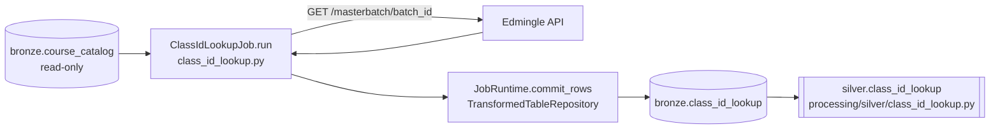

# Class ID Lookup Job

## 1. Overview

The `attendance_data.class_id_lookup` job (class `ClassIdLookupJob`, module
`api_scripts/attendance_data/class_id_lookup/class_id_lookup.py`) is a direct 1:1 port of a legacy
standalone script named `resolve_class_ids.py` — documented as Stage 2 of a legacy three-stage
Edmingle attendance pipeline. For every distinct `batch_id` found in `bronze.course_catalog`, it
calls `GET /masterbatch/{batch_id}` and resolves the hidden per-subject `class_id`(s) associated
with that batch, writing them to `bronze.class_id_lookup`.

**Status: this job is currently DISABLED and has never been run against the live Edmingle API.**
It is fully coded and registered in the job registry, but `is_enabled` is `false` in
`system.api_scripts`, in `system.pipelines`, and in `services/scheduler/jobs.example.yaml`, and no
scheduler process is deployed on the VPS (verified directly — see Section 17).
`bronze.class_id_lookup` contains **0 rows** in the live database (verified by direct query on
2026-09-24) — consistent with its only upstream input, `bronze.course_catalog`, also being empty.

## 2. Purpose

To resolve Edmingle's confusingly-named `class_id` values (the actual per-subject identifiers
attendance is queried against) for every batch known to the catalogue, so that the next stage of
the pipeline (`attendance_data.class_session_attendance`) has a `class_id` to iterate over.

## 3. High-Level Data Flow



`processing/silver/class_id_lookup.py` reads from `bronze.class_id_lookup` directly (single
Bronze source, no reconciliation) and excludes rows with no resolved `class_id`. Per
`system.pipelines`, the corresponding Silver pipeline (`silver_class_id_lookup`) is also
`is_enabled = false`.

## 4. Project / Repository Structure

```
api_scripts/attendance_data/class_id_lookup/
├── __init__.py                  # "Class-id lookup job, ported from Attendance data/resolve_class_ids.py."
├── class_id_lookup.py            # ClassIdLookupJob class + normalization/fetch/read helpers
└── README.md                     # Porting notes, dependency chain, response-shape documentation

api_scripts/attendance_data/
├── __init__.py
└── README.md                     # Parent-package notes for the attendance_data.* job family

api_scripts/common/               # Shared framework (see attendance job's doc, Section 4)
api_scripts/runner.py             # job_registry(), run_job()
shared/config/settings.py         # DatabaseSettings, WarehouseSettings, EdmingleSettings
shared/database.py                # Database (used directly by this job for read-only queries)
services/scheduler/jobs.example.yaml
```

## 5. Source System

| Source | Type | Endpoint | HTTP Method | Authentication | Parameters | Pagination | Rate Limit |
|---|---|---|---|---|---|---|---|
| Edmingle | REST/JSON | `/masterbatch/{batch_id}` | GET | `apikey`+`ORGID` headers (session-level, `EdmingleApiClient`) **plus** `apikey`/`org_id` as query params (belt-and-braces, matching the original script) | Path: `batch_id`; query: `apikey`, `org_id` | None — one call per batch_id, no page/cursor concept | Client-side `EDMINGLE_MIN_REQUEST_INTERVAL_SECONDS`; superseded the original script's own hand-rolled ~24-calls/min limiter |
| Internal (Postgres) | Read-only lookup | `bronze.course_catalog` (via `SELECT DISTINCT ... WHERE batch_id IS NOT NULL`) | N/A (SQL) | Standard `DatabaseSettings` connection | N/A | N/A | N/A |

## 6. Extraction Process

1. `_load_catalogue_batches()` opens its **own short-lived `Database` connection** (separate from
   `JobRuntime`'s write-oriented repositories — a read-only lookup against an upstream job's
   table) and runs:
   `SELECT DISTINCT batch_id, bundle_id, bundle_name, batch_name FROM bronze.course_catalog WHERE
   batch_id IS NOT NULL ORDER BY batch_id`. Each `batch_id` is normalized via
   `_normalize_batch_id()` and deduplicated (first occurrence kept per normalized id).
2. `_load_already_processed()` opens a second short-lived connection and runs
   `SELECT DISTINCT batch_id FROM bronze.class_id_lookup` to build the resume set — any batch_id
   already present in the output table is skipped.
3. `run()` computes `pending = catalogue_batches - already_processed`, then iterates `pending`
   one batch at a time: `_fetch_classes_for_batch(runtime, batch_id)` calls
   `GET /masterbatch/{batch_id}` and extracts `payload["class"]["courses_array"]`.
4. `_courses_array_to_records(courses_array)` converts each `courses_array` item into a flat
   record (see Section 9).
5. Each batch's resolved records become one or more rows, committed via `commit_rows()`
   **immediately after each batch** (not batched across multiple batch_ids), updating the
   checkpoint after every batch.

## 7. Detailed Function Documentation

### `class ClassIdLookupJob`
- `name = "attendance_data.class_id_lookup"`, `checkpoint_partition_key = "default"`.
- `run(self, runtime, checkpoint) -> None`: loads catalogue batches and already-processed batches,
  computes the pending set, and for each pending batch fetches, transforms, and commits — one
  `commit_rows()` call per batch_id, so a crash or rate-limit block loses no already-resolved
  progress.

### Fetch
- `_fetch_classes_for_batch(self, runtime, batch_id) -> list[Any]`: calls
  `GET /masterbatch/{batch_id}` with `apikey`/`org_id` as query params (in addition to the
  session's `apikey`/`ORGID` headers). Returns `[]` if `payload["class"]` is missing/not a dict,
  or if `courses_array` is missing/not a list. **Confirmed live response shape** (per the code's
  own docstring, said to contradict Edmingle's official docs):
  `{"code": 200, "class": {"courses_array": [...], "class_id": <this is actually the BATCH id>}}`
  — the top-level `class.class_id` is misleadingly named; real per-subject `class_id` values live
  inside `class.courses_array[].class_id`.

### Transform
- `_courses_array_to_records(courses_array) -> list[dict]`: for each dict item in
  `courses_array`, extracts `class_id`, `tutor_name`, `tutor_id`, `total_classes`,
  `completed_classes` (source key `completed`), `cancelled_classes` (source key `cancelled`),
  `num_users`, and `associated_masterbatches` (a list, joined into a comma-separated string if
  present).
- `_normalize_batch_id(value) -> str | None`: normalizes numeric-looking values (e.g. the string
  `"12345.0"`, which can arise from `bronze.course_catalog.batch_id` having passed through a
  pandas float column upstream) to a canonical integer string `"12345"`. Non-numeric values pass
  through unchanged rather than being dropped.

### Row assembly (inline in `run()`)
- For each pending batch, if `class_records` is empty, a single placeholder record `[{}]` is used
  instead — "matches `resolve_class_ids.py`'s `class_records = [{}]` fallback exactly" per the
  code comment — so a batch resolving to zero classes still produces one row (with `class_id` and
  other resolved fields `NULL`) rather than being silently dropped.

### Read helpers
- `_load_catalogue_batches(self) -> list[dict]` (Section 6, step 1).
- `_load_already_processed(self) -> set[str]` (Section 6, step 2).

## 8. Input Parameters & Configuration

This job has **no job-specific `CLASS_ID_LOOKUP_*` env vars** — all behavior is either fixed in
code or driven by the shared settings:

- `EdmingleSettings.from_environment()`: `EDMINGLE_API_BASE_URL`, `EDMINGLE_API_KEY`,
  `EDMINGLE_API_KEY_EXPIRES_AT`, `EDMINGLE_API_KEY_STOP_DAYS_BEFORE_EXPIRY`,
  `EDMINGLE_ORGANIZATION_ID`, `EDMINGLE_INSTITUTE_ID` (not used by this job),
  `EDMINGLE_REQUEST_TIMEOUT_SECONDS`, `EDMINGLE_MAX_RETRIES`,
  `EDMINGLE_MIN_REQUEST_INTERVAL_SECONDS`, `EDMINGLE_INITIAL_RETRY_DELAY_SECONDS`,
  `EDMINGLE_MAXIMUM_RETRY_DELAY_SECONDS`.
- `DatabaseSettings.from_environment()`: `WAREHOUSE_DB_HOST`, `WAREHOUSE_DB_PORT`,
  `WAREHOUSE_DB_NAME`, `WAREHOUSE_DB_USER`, `WAREHOUSE_DB_PASSWORD`, `WAREHOUSE_DB_SSLMODE`,
  `WAREHOUSE_DB_CONNECT_TIMEOUT_SECONDS`, `WAREHOUSE_DB_STATEMENT_TIMEOUT_MS`,
  `WAREHOUSE_DB_POOL_MIN_CONNECTIONS`, `WAREHOUSE_DB_POOL_MAX_CONNECTIONS` — used both by the
  job's own read-only `Database` connections and by the runner's write-oriented `Database`.
- `WarehouseSettings.from_environment()`: `WAREHOUSE_ENVIRONMENT`, `WAREHOUSE_LOG_LEVEL`,
  `WAREHOUSE_DATA_DIRECTORY`, `WAREHOUSE_LOG_DIRECTORY`, `WAREHOUSE_MIN_FREE_DISK_MB`,
  `WAREHOUSE_SCHEDULER_ENABLED`, `WAREHOUSE_SCHEDULER_CONFIG`.

No actual `.env` values were read or printed as part of producing this document.

## 9. Data Transformation

- Input rows are `(batch_id, bundle_id, bundle_name, batch_name)` tuples, deduplicated by
  normalized `batch_id`.
- For each batch, the API response's `courses_array` becomes N output rows (N = number of
  resolved classes for that batch), each carrying the same `bundle_id`/`bundle_name`/`batch_id`/
  `batch_name` context plus its own `class_id`, `tutor_name`, `tutor_id`, `total_classes`,
  `completed_classes`, `cancelled_classes`, `num_users`, `associated_masterbatches`.
- Zero, one, or multiple resolved `class_id`s per batch are all valid outcomes: zero produces one
  row with `class_id = NULL`; multiple produce multiple rows sharing the same batch context.
- No numeric/date derivation beyond `_normalize_batch_id`'s int-string canonicalization and the
  list-to-comma-string join for `associated_masterbatches`.

## 10. Output Dataset

`bronze.class_id_lookup`, written incrementally via one `JobRuntime.commit_rows()` call **per
pending batch_id** (not one call for the whole run), upserting on `(batch_id, class_id)`.

## 11. Output Schema

Confirmed live via `\d bronze.class_id_lookup` (2026-09-24):

| Column | Data Type | Description | Source/Derived |
|---|---|---|---|
| id | bigint (identity) | Surrogate key | Generated by Postgres |
| pipeline_run_id | uuid, not null | FK to `audit.pipeline_runs.id` | Set by `TransformedTableRepository` |
| bundle_id | text | Course bundle id | From `bronze.course_catalog` lookup row |
| bundle_name | text | Course bundle name | From `bronze.course_catalog` lookup row |
| batch_id | text, not null | Edmingle batch id | Normalized via `_normalize_batch_id` |
| batch_name | text | Batch name | From `bronze.course_catalog` lookup row |
| class_id | text | Resolved per-subject class id | `courses_array[].class_id`; `NULL` if none resolved |
| tutor_name | text | Tutor name | `courses_array[].tutor_name` |
| tutor_id | text | Tutor id | `courses_array[].tutor_id` |
| total_classes | numeric | Total classes for this class_id | `courses_array[].total_classes` |
| completed_classes | numeric | Completed class count | `courses_array[].completed` |
| cancelled_classes | numeric | Cancelled class count | `courses_array[].cancelled` |
| num_users | numeric | User/student count | `courses_array[].num_users` |
| associated_masterbatches | text | Comma-joined list of associated batch ids | `courses_array[].associated_masterbatches` (list → string) |
| received_at | timestamptz, not null | Row ingestion time | Set by `TransformedTableRepository` |
| created_at | timestamptz, not null, default now() | Row creation time | Postgres default |

Unique constraint: `(batch_id, class_id)`.

## 12. Data Quality & Validation

- Rows with an unresolvable `courses_array` entry that isn't a dict are silently skipped
  (`if not isinstance(item, dict): continue`) inside `_courses_array_to_records`.
- A batch with zero resolved classes still produces exactly one row (via the `[{}]` fallback) so
  it is never silently dropped from the output — an explicit design choice ported from the legacy
  script.
- `_normalize_batch_id` passes non-numeric values through unchanged rather than dropping them,
  preferring to preserve data over discarding it.
- No explicit schema/contract validation is performed on the `/masterbatch/{batch_id}` response
  beyond the `isinstance` checks in `_fetch_classes_for_batch` — a malformed `class` or
  `courses_array` value is treated as "no classes" (`[]`), not as an error.

## 13. Error Handling & Logging

- HTTP-layer retry/backoff and fatal-status handling are entirely delegated to
  `EdmingleApiClient.get_json()` — same mechanism as every other job. An unrecoverable HTTP error
  for any one batch_id aborts the whole run (the loop has no per-batch try/except).
- `runner.run_job()` records the run as `FAILED` in `audit.pipeline_runs` on any unhandled
  exception, storing `type(exc).__name__` as `error_category` and a fixed placeholder string as
  `error_message`.
- Because each batch's rows are committed and checkpointed immediately, a mid-run failure leaves
  all previously-processed batches durably persisted; re-running the job resumes from
  `_load_already_processed()`'s output-table-based resume set, not from the failed batch onward
  specifically — any batch not yet present in `bronze.class_id_lookup` is retried.
- This module does not define its own dedicated `LOGGER`; it relies on the shared client's and
  runner's logging.

## 14. Dependencies

- `psycopg2` (via `TransformedTableRepository`'s `execute_values`/`Json`, and via this job's own
  direct `Database` reads).
- `requests` (via `EdmingleApiClient`).
- Internal: `api_scripts.common.repositories.utc_iso`, `api_scripts.common.runtime.JobRuntime`,
  `shared.config.DatabaseSettings`, `shared.database.Database`.
- **No pandas/numpy dependency** — unlike `attendance` and `attendance_data.catalogue`, this job
  works with plain Python dicts/tuples throughout.
- **Upstream data dependency: `bronze.course_catalog`**, populated by the
  `attendance_data.catalogue` job. If that table is empty, this job has nothing to iterate over
  and completes successfully having written zero rows (not an error condition).

## 15. Setup

1. Run `attendance_data.catalogue` first, so `bronze.course_catalog` is populated (currently 0
   rows — see Section 21).
2. Ensure `EDMINGLE_API_KEY`, `EDMINGLE_ORGANIZATION_ID`, and the `WAREHOUSE_DB_*` variables are
   set in `.env`.
3. Ensure migration `006_legacy_pipeline_bronze_tables.sql` (creates `bronze.class_id_lookup`) has
   been applied — confirmed present on the live database.
4. Flip `is_enabled` to `true` for `attendance_data.class_id_lookup` in `system.api_scripts`,
   `system.pipelines`, and `services/scheduler/jobs.example.yaml` only with explicit project-owner
   authorization (see Section 17).

## 16. How to Run

```
docker compose run --rm warehouse-cli python warehouse_cli.py collect attendance_data.class_id_lookup
```

Confirmed registered job name string: `"attendance_data.class_id_lookup"` in
`api_scripts/runner.py::job_registry()`.

## 18. Database / Warehouse Integration

- **Checkpoint mechanism**: `system.collection_checkpoints`, keyed by
  `(job_name="attendance_data.class_id_lookup", partition_key="default")`. The checkpoint payload
  is `{"batches_processed": N, "updated_at": <iso>}`, updated after **every** processed batch (not
  just at the end of the run) — so `batches_processed` reflects incremental progress within a
  single run as well as across runs.
- **Resume mechanism (distinct from the checkpoint)**: this job's actual resume logic is
  output-table-based, not checkpoint-based — `_load_already_processed()` queries
  `bronze.class_id_lookup` directly for already-seen `batch_id`s, rather than reading back the
  `system.collection_checkpoints` row. The checkpoint's `batches_processed` counter is informational
  telemetry, not what drives resumption.
- **Audit trail**: `audit.pipeline_runs` / `audit.events`, identical mechanism to every other job.
- **Upsert behavior**: `INSERT ... ON CONFLICT (batch_id, class_id) DO UPDATE SET <all non-key
  columns>`.
- **Primary/unique keys**: PK `id` (identity); unique `(batch_id, class_id)`; FK
  `pipeline_run_id` → `audit.pipeline_runs.id`.
- **Two extra read-only DB connections per run**: `_load_catalogue_batches()` and
  `_load_already_processed()` each open and close their own short-lived `Database` connection
  (named `class_id_lookup-catalogue-read` / `class_id_lookup-checkpoint-read`), separate from the
  `JobRuntime`'s write-oriented connection.

## 17. Automation / Scheduling

Confirmed directly from the live system:

- `services/scheduler/jobs.example.yaml` lists `attendance_data_class_id_lookup_weekly`
  (`job_key: attendance_data.class_id_lookup`, `interval_minutes: 10080`) with `is_enabled: false`.
- `system.api_scripts` row `job_name = 'attendance_data.class_id_lookup'` has `is_enabled = false`.
- `system.pipelines` row `pipeline_name = 'attendance_data.class_id_lookup'` has
  `is_enabled = false`.
- No `warehouse-scheduler` container is currently running on the VPS (`docker ps -a` shows only
  webhook-related containers) — the scheduler service exists in `docker-compose.yml` but is not
  deployed.

## 19. Data Lineage

```
bronze.course_catalog (upstream job: attendance_data.catalogue)
  → ClassIdLookupJob reads distinct batch_ids
    → GET /masterbatch/{batch_id} (Edmingle)
      → bronze.class_id_lookup
        → silver.class_id_lookup (processing/silver/class_id_lookup.py)
          → attendance_data.class_session_attendance (downstream job, reads class_id + bundle context)
          → Gold: Not identified in the current implementation.
```

## 20. Important Business / Technical Rules

- **Hard dependency on `attendance_data.catalogue` having already run.** If
  `bronze.course_catalog` is empty, this job has nothing to iterate over and writes zero rows; it
  does not error.
- Deduplicates catalogue batches by normalized `batch_id`, keeping only the first occurrence —
  matches the legacy script's `drop_duplicates(subset=["batch_id"], keep="first")`.
- Resume is output-table-based (`bronze.class_id_lookup` presence), not checkpoint-based.
- The `class.class_id` field in the raw API response is **not** a real class id — it is actually
  the batch id, confirmed against the live API and explicitly noted as contradicting Edmingle's
  own documentation. The real class ids are in `class.courses_array[].class_id`.
- Sends `apikey`/`org_id` both as headers (via the shared client) and as query params, replicating
  the legacy script's belt-and-braces auth approach.

## 21. Known Limitations

### Confirmed limitations
- **This job is disabled and has 0 rows in production.** It has never been run against the live
  Edmingle API. `is_enabled = false` in `system.api_scripts`, `system.pipelines`, and
  `services/scheduler/jobs.example.yaml`; `bronze.class_id_lookup` contains 0 rows (confirmed by
  direct query, 2026-09-24). No scheduler container is deployed.
- Its sole upstream data source, `bronze.course_catalog`, is also empty (0 rows) — even once
  enabled, this job would currently have nothing to process until `attendance_data.catalogue` is
  run successfully first.
- One `commit_rows()` call per batch_id (not batched) means a very large catalogue could produce a
  correspondingly large number of small transactions; no batching/throttling beyond the shared
  client's rate limiting is implemented.

### Requires confirmation
- Whether the documented "confirmed live" response shape (`class.class_id` actually being the
  batch id) still holds if Edmingle changes its API — this was confirmed against the live API at
  some prior point per the code comments, not independently re-verified during this audit (no live
  API calls were made).
- Expected run frequency / SLA for keeping `bronze.class_id_lookup` in sync with
  `bronze.course_catalog` once both are enabled: not identified in the current implementation.

## 22. Troubleshooting

| Symptom | Likely cause | Where to look |
|---|---|---|
| Job completes but writes zero rows | `bronze.course_catalog` is empty | Run `attendance_data.catalogue` first |
| Same batches keep getting re-fetched every run | `bronze.class_id_lookup` write failing silently or being cleared between runs | Check `_load_already_processed()` query results directly |
| `class_id` values look like batch ids | Misreading `class.class_id` (top-level) instead of `class.courses_array[].class_id` | `_fetch_classes_for_batch()` docstring |
| Rate-limit errors (`429`) | Large catalogue causing many rapid `/masterbatch` calls | Tune `EDMINGLE_MIN_REQUEST_INTERVAL_SECONDS` |

## 23. Maintenance Guide

- Do not change the per-batch commit granularity (one `commit_rows()` call per batch) without
  understanding the crash-safety tradeoff it provides — batching multiple batch_ids per
  transaction would reduce round-trips but increase re-work on a mid-run crash.
- Keep `COLUMNS`/`UNIQUE_COLUMNS` in this file's module scope in sync with
  `bronze.class_id_lookup`'s actual schema if the table is ever migrated.
- If Edmingle's `/masterbatch/{batch_id}` response shape changes, update both this job and its
  README's documented "confirmed live" shape together.

## 24. Upstream & Downstream Dependencies

- **Upstream**: `bronze.course_catalog` (populated by `attendance_data.catalogue`) — a hard
  dependency; this job has no independent data source of its own besides Edmingle's
  per-batch lookup.
- **Downstream**: `attendance_data.class_session_attendance` reads `bronze.class_id_lookup`
  directly for its own `class_id` iteration (see that job's documentation).
  `processing/silver/class_id_lookup.py` also reads this table directly.

## 25. Security Considerations

- `EDMINGLE_API_KEY` and `EDMINGLE_ORGANIZATION_ID` are read from environment variables only; no
  values are reproduced in this document.
- Same audit-table error-message redaction as every other job.
- No PII beyond tutor names/ids is written to `bronze.class_id_lookup`, per the confirmed live
  schema (Section 11).

## 26. Change Log

| Date | Author | Change |
|---|---|---|
| 2026-09-24 | | Initial version |

## 27. Ownership

Requires confirmation from the project owner.
