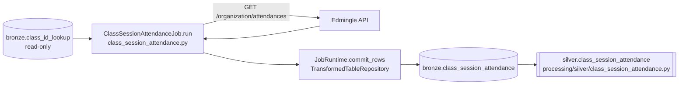

# Class Session Attendance Job

## 1. Overview

The `attendance_data.class_session_attendance` job (class `ClassSessionAttendanceJob`, module
`api_scripts/attendance_data/class_session_attendance/class_session_attendance.py`) is a direct
port of a legacy standalone script named `build_session_attendance.py` — documented as Stage 3 of
the legacy three-stage Edmingle attendance pipeline — together with shared extract functions
(`fetch_org_attendances`, `sessions_to_dataframe`, IST helpers, status classification) imported
from a companion legacy script, `attendance_crossvalidation.py`. For every `class_id` in
`bronze.class_id_lookup`, it calls `GET /organization/attendances` for a configured date window
and writes session-wise (not student-wise) attendance to `bronze.class_session_attendance`.

**Status: this job is currently DISABLED and has never been run against the live Edmingle API.**
It is fully coded and registered in the job registry, but `is_enabled` is `false` in
`system.api_scripts`, in `system.pipelines`, and in `services/scheduler/jobs.example.yaml`, and no
scheduler process is deployed on the VPS (verified directly — see Section 17).
`bronze.class_session_attendance` contains **0 rows** in the live database (verified by direct
query on 2026-09-24) — consistent with its upstream input, `bronze.class_id_lookup`, also being
empty. The job's own README additionally notes that `/organization/attendances` is a **metered**
endpoint, so enabling it needs a deliberate, credit-aware decision beyond just registry wiring.

## 2. Purpose

To produce a session-level (one row per Edmingle session) attendance dataset — enrollment,
present/not-marked counts, attendance percentage, session timing, and conducted/not-conducted
status — for every resolved `class_id`, over an explicit, operator-specified date window.

## 3. High-Level Data Flow



`processing/silver/class_session_attendance.py` reads from `bronze.class_session_attendance`
directly (single Bronze source, no reconciliation). Per `system.pipelines`, the corresponding
Silver pipeline (`silver_class_session_attendance`) is also `is_enabled = false`.

## 4. Project / Repository Structure

```
api_scripts/attendance_data/class_session_attendance/
├── __init__.py                       # Module docstring naming both ported legacy scripts
├── class_session_attendance.py        # ClassSessionAttendanceJob + IST/normalization/fetch/read helpers
└── README.md                          # Porting notes, dependency chain, field mapping, difference-from-report55 notes

api_scripts/attendance_data/
├── __init__.py
└── README.md                          # Parent-package notes for the attendance_data.* job family

api_scripts/common/                    # Shared framework (see attendance job's doc, Section 4)
api_scripts/runner.py                  # job_registry(), run_job()
shared/config/settings.py              # DatabaseSettings, WarehouseSettings, EdmingleSettings
shared/database.py                     # Database (used directly by this job for read-only queries)
services/scheduler/jobs.example.yaml
```

## 5. Source System

| Source | Type | Endpoint | HTTP Method | Authentication | Parameters | Pagination | Rate Limit |
|---|---|---|---|---|---|---|---|
| Edmingle | REST/JSON | `/organization/attendances` | GET | `apikey`+`ORGID` headers (session-level, `EdmingleApiClient`) **plus** `org_id`/`apikey` as query params (belt-and-braces, matching the original scripts) | `org_id`, `apikey`, `start` (unix ts), `end` (unix ts), `class_id` | None — one call per `class_id` for the whole configured date window; no page/cursor concept | Client-side `EDMINGLE_MIN_REQUEST_INTERVAL_SECONDS`; superseded the original scripts' own hand-rolled ~24-calls/min limiter (`RateLimiter` from `pipeline_common.py`) and custom `429` "Try after X minutes" parser. **This endpoint is documented in the job's README as metered** — Requires confirmation from the project owner on Edmingle-side credit/quota limits. |
| Internal (Postgres) | Read-only lookup | `bronze.class_id_lookup` (via `SELECT DISTINCT ... WHERE class_id IS NOT NULL`) | N/A (SQL) | Standard `DatabaseSettings` connection | N/A | N/A | N/A |

## 6. Extraction Process

1. `_date_window()` reads `CLASS_SESSION_ATTENDANCE_START_DATE` / `_END_DATE` (both **required**,
   `YYYY-MM-DD`) and converts each to a Unix timestamp via `to_unix()` (IST-midnight, manual
   `+5:30` offset). Raises `ValueError` if either is missing — unlike `attendance`, there is no
   default lookback window.
2. `_load_class_id_lookup()` opens its **own short-lived `Database` connection** and runs
   `SELECT DISTINCT class_id, bundle_id, bundle_name FROM bronze.class_id_lookup WHERE class_id IS
   NOT NULL ORDER BY class_id`, normalizing and deduplicating by `class_id`.
3. `_load_already_processed()` opens a second short-lived connection and runs
   `SELECT DISTINCT class_id FROM bronze.class_session_attendance` to build the resume set.
4. `run()` computes `pending = lookup_entries - already_processed`, then iterates one `class_id`
   at a time: `_fetch_org_attendances(runtime, class_id, start_ts, end_ts)` calls
   `GET /organization/attendances`.
5. Each class's returned `classes` list is converted to session records via
   `_session_from_class_row()`, numbered via `_assign_session_numbers()`, and committed via one
   `commit_rows()` call **per class_id**, updating the checkpoint after every class_id.
6. A `class_id` with no sessions (self-paced content) is expected and normal — it is still counted
   as processed via the checkpoint, not treated as an error.

## 7. Detailed Function Documentation

### `class ClassSessionAttendanceJob`
- `name = "attendance_data.class_session_attendance"`, `checkpoint_partition_key = "default"`.
- `run(self, runtime, checkpoint) -> None`: resolves the date window, loads pending class_ids,
  fetches/transforms/commits one class_id at a time.

### Fetch
- `_fetch_org_attendances(self, runtime, class_id, start_ts, end_ts) -> list[dict]`: calls
  `GET /organization/attendances` with `org_id`/`apikey`/`start`/`end`/`class_id` as query params.
  Checks `payload.get("code") == 200`; a non-200 application code is logged as a warning and
  treated as "no sessions" (`return []`) rather than raised — matching the original script's
  `if data.get("code") != 200: ... return []`. Returns `payload["classes"]` if it is a list, else
  `[]`.

### Module-level helpers (ported from the legacy scripts)
- `to_unix(date_str) -> int`: parses `YYYY-MM-DD` as IST midnight → unix timestamp via a manual
  `+5:30` offset (`IST_OFFSET_SECONDS = 5.5 * 3600`), no `pytz`/`zoneinfo` — kept exactly as
  written to avoid drifting from the source pipeline's IST-boundary handling.
- `unix_to_ist(ts, fmt="%Y-%m-%d %H:%M:%S") -> str | None`: converts a UTC unix timestamp to an
  IST-formatted string via the same manual-offset style.
- `_id_text(value) -> str | None`: normalizes a numeric-looking id (`session_id`/`class_id`/
  `master_batch_id`) to a canonical integer string (e.g. `"12345.0"` → `"12345"`), matching the
  original pandas pipeline's `Int64`-cast intent while writing into this table's text-typed id
  columns.
- `_text(value) -> str | None`: plain `str()`-or-`None` cast.
- `_session_from_class_row(row, bundle_id, bundle_name) -> dict | None`: maps one raw session row
  from the API response to the output column set (see Section 9 for field derivations). Returns
  `None` (skipping the row) if the row has no resolvable `session_id`, since
  `bronze.class_session_attendance.session_id` is `NOT NULL`.
- `_assign_session_numbers(sessions) -> None`: sorts the list of session dicts by
  `session_start_ist` (missing/`None` sorts last), then numbers them sequentially **per
  `master_batch_id`** (not per `class_id`) — this is intentionally different from
  `report55_session_attendance`'s per-`batch_id` numbering (see Section 20).
- `_row_tuple(session) -> tuple`: builds the final row tuple in `COLUMNS` order.

### Read helpers
- `_load_class_id_lookup(self) -> list[dict]` (Section 6, step 2).
- `_load_already_processed(self) -> set[str]` (Section 6, step 3).

## 8. Input Parameters & Configuration

| Env var | Default | Notes |
|---|---|---|
| `CLASS_SESSION_ATTENDANCE_START_DATE` | none — **required** | `YYYY-MM-DD`; job raises `ValueError` if unset. |
| `CLASS_SESSION_ATTENDANCE_END_DATE` | none — **required** | `YYYY-MM-DD`; job raises `ValueError` if unset. |

No default lookback exists for this job (unlike `attendance`), matching the original CLI's
required `--start`/`--end` arguments — a bulk historical pull needs an intentional, bounded range.

Shared settings:

- `EdmingleSettings.from_environment()`: `EDMINGLE_API_BASE_URL`, `EDMINGLE_API_KEY`,
  `EDMINGLE_API_KEY_EXPIRES_AT`, `EDMINGLE_API_KEY_STOP_DAYS_BEFORE_EXPIRY`,
  `EDMINGLE_ORGANIZATION_ID`, `EDMINGLE_INSTITUTE_ID` (not used by this job),
  `EDMINGLE_REQUEST_TIMEOUT_SECONDS`, `EDMINGLE_MAX_RETRIES`,
  `EDMINGLE_MIN_REQUEST_INTERVAL_SECONDS`, `EDMINGLE_INITIAL_RETRY_DELAY_SECONDS`,
  `EDMINGLE_MAXIMUM_RETRY_DELAY_SECONDS`.
- `DatabaseSettings.from_environment()`: `WAREHOUSE_DB_HOST`, `WAREHOUSE_DB_PORT`,
  `WAREHOUSE_DB_NAME`, `WAREHOUSE_DB_USER`, `WAREHOUSE_DB_PASSWORD`, `WAREHOUSE_DB_SSLMODE`,
  `WAREHOUSE_DB_CONNECT_TIMEOUT_SECONDS`, `WAREHOUSE_DB_STATEMENT_TIMEOUT_MS`,
  `WAREHOUSE_DB_POOL_MIN_CONNECTIONS`, `WAREHOUSE_DB_POOL_MAX_CONNECTIONS`.
- `WarehouseSettings.from_environment()`: `WAREHOUSE_ENVIRONMENT`, `WAREHOUSE_LOG_LEVEL`,
  `WAREHOUSE_DATA_DIRECTORY`, `WAREHOUSE_LOG_DIRECTORY`, `WAREHOUSE_MIN_FREE_DISK_MB`,
  `WAREHOUSE_SCHEDULER_ENABLED`, `WAREHOUSE_SCHEDULER_CONFIG`.

No actual `.env` values were read or printed as part of producing this document.

## 9. Data Transformation

Per-session field derivations (in `_session_from_class_row`), ported as-is from the legacy shared
functions:

- `session_id`, `class_id`, `master_batch_id`: normalized via `_id_text` to canonical integer-text
  strings.
- `class_date`: `unix_to_ist(row["class_date"], "%Y-%m-%d")` — only the IST-converted string is
  stored; the raw UTC unix value is never written.
- `total_enrolled_at_session`, `present_count` (from `present`), `not_marked_count` (from
  `not_marked`): copied straight across.
- `attendance_pct`: `round(100 * present / total, 2)` if `total` is truthy, else `NULL`.
- `taken_by_name`, `individual_batch_attendance`: copied across (`individual_batch_attendance`
  cast to text).
- `session_start_ist` / `session_end_ist`: `unix_to_ist(gmt_start_time)` / `unix_to_ist(gmt_end_time)`.
- `session_duration_minutes`: `round((gmt_end_time - gmt_start_time) / 60, 1)` if both are truthy,
  else `NULL`.
- `is_session_conducted`: `row["status"] not in NOT_CONDUCTED_STATUSES` where
  `NOT_CONDUCTED_STATUSES = {2, 3}` (Postponed, Cancelled). Every other Edmingle status code
  (0 NotSignedIn, 1 SignedIn, 4 LateSignIn, 5 MissedSignIn, 6 ExcusedAbsent, 7 Absent) counts as
  conducted. **The raw numeric status code/label is never stored** — only this derived boolean.
- `bundle_id` / `bundle_name`: attached from the `class_id_lookup` row for that `class_id`, **not**
  from the `/organization/attendances` response itself — the original script sourced these two
  fields the same way, from its own input lookup file.
- `session_number`: assigned in a separate pass (`_assign_session_numbers`) after all sessions for
  a class_id are collected — sorted chronologically by `session_start_ist` (missing sorts last),
  then numbered sequentially **per `master_batch_id`**.
- `master_batch_name`: `.strip()`-ed when it is a string (source data often has a leading space).

This is **not** an incremental/windowed recompute in the same sense as `attendance` — each
`class_id` is processed exactly once (checkpointed via output-table presence), for the single
explicit date window given at invocation time.

## 10. Output Dataset

`bronze.class_session_attendance`, written incrementally via one `JobRuntime.commit_rows()` call
**per pending class_id**, upserting on `(session_id)`.

## 11. Output Schema

Confirmed live via `\d bronze.class_session_attendance` (2026-09-24):

| Column | Data Type | Description | Source/Derived |
|---|---|---|---|
| id | bigint (identity) | Surrogate key | Generated by Postgres |
| pipeline_run_id | uuid, not null | FK to `audit.pipeline_runs.id` | Set by `TransformedTableRepository` |
| session_id | text, not null | Edmingle session id | `row["id"]`, normalized via `_id_text` |
| class_id | text | Class id (join key to `class_id_lookup`) | `row["class_id"]`, normalized |
| class_name | text | Class name | `row["class_name"]` |
| master_batch_id | text | Master batch id (session-number grouping key) | `row["master_batch_id"]`, normalized |
| master_batch_name | text | Master batch name (stripped if string) | `row["master_batch_name"]` |
| bundle_id | text | Course bundle id | From `bronze.class_id_lookup` row, not the API response |
| bundle_name | text | Course bundle name | From `bronze.class_id_lookup` row, not the API response |
| class_date | date | Session date (IST) | `unix_to_ist(row["class_date"], "%Y-%m-%d")` |
| total_enrolled_at_session | numeric | Enrollment at session time | `row["total"]` |
| present_count | numeric | Present count | `row["present"]` |
| not_marked_count | numeric | Not-marked count | `row["not_marked"]` |
| attendance_pct | numeric | `100 * present / total`, rounded 2dp | Derived |
| taken_by_name | text | Instructor who took the session | `row["taken_by_name"]` |
| individual_batch_attendance | text | Per-batch attendance detail | `row["individual_batch_attendance"]` (cast to text) |
| session_start_ist | timestamp without time zone | Session start (IST) | `unix_to_ist(row["gmt_start_time"])` |
| session_end_ist | timestamp without time zone | Session end (IST) | `unix_to_ist(row["gmt_end_time"])` |
| session_duration_minutes | numeric | `(gmt_end - gmt_start)/60`, rounded 1dp | Derived |
| is_session_conducted | boolean | `status not in {2,3}` | Derived |
| session_number | integer | Cumulative order per `master_batch_id` | Derived |
| received_at | timestamptz, not null | Row ingestion time | Set by `TransformedTableRepository` |
| created_at | timestamptz, not null, default now() | Row creation time | Postgres default |

Unique constraint: `(session_id)`.

## 12. Data Quality & Validation

- Rows with no resolvable `session_id` are skipped (`_session_from_class_row` returns `None`),
  since the column is `NOT NULL`.
- A non-200 application-level `code` in the API response is logged as a warning and treated as
  "no sessions" for that class_id rather than raised — the run continues to the next class_id
  instead of aborting.
- `_load_class_id_lookup` excludes rows with `class_id IS NULL` and deduplicates by `class_id`
  (first occurrence kept), mirroring the original's
  `lookup_df.dropna(subset=["class_id"]).drop_duplicates(subset=["class_id"])`.
- No independent schema/contract validation of the `/organization/attendances` response body
  beyond the `payload.get("code")` and `isinstance(classes, list)` checks.

## 13. Error Handling & Logging

- HTTP-layer retry/backoff and fatal-status handling are entirely delegated to
  `EdmingleApiClient.get_json()`. An unrecoverable HTTP-level error for any one class_id aborts the
  whole run (no per-class_id try/except around the HTTP call itself).
- The application-level `{"code": ..., "classes": [...]}` envelope is checked explicitly by this
  job (`payload.get("code") != 200` → logged warning, `[]` returned) since the generic client only
  validates Edmingle's own `error_code` 6001/6002, not this endpoint's own success/failure code.
- `runner.run_job()` records the run as `FAILED` in `audit.pipeline_runs` on any unhandled
  exception, storing `type(exc).__name__` as `error_category` and a fixed placeholder string as
  `error_message`.
- Logger name: `warehouse.job` (module-level `LOGGER`, shared literal name with
  `api_scripts/common/runtime.py`'s own logger — not a dedicated `warehouse.job.class_session_attendance`
  name). Key log point: the non-200 application-code warning in `_fetch_org_attendances`.

## 14. Dependencies

- `psycopg2` (via `TransformedTableRepository` and this job's own direct `Database` reads).
- `requests` (via `EdmingleApiClient`).
- Internal: `api_scripts.common.repositories.utc_iso`, `api_scripts.common.runtime.JobRuntime`,
  `shared.config.DatabaseSettings`, `shared.database.Database`.
- **No pandas/numpy dependency** — like `class_id_lookup`, this job works with plain Python
  dicts/tuples/lists throughout.
- **Upstream data dependency: `bronze.class_id_lookup`**, populated by
  `attendance_data.class_id_lookup`, which itself depends on `attendance_data.catalogue`. If
  `bronze.class_id_lookup` is empty, this job has nothing to iterate over and completes having
  written zero rows (not an error).

## 15. Setup

1. Run `attendance_data.catalogue`, then `attendance_data.class_id_lookup`, so
   `bronze.class_id_lookup` is populated (currently 0 rows — see Section 21).
2. Ensure `EDMINGLE_API_KEY`, `EDMINGLE_ORGANIZATION_ID`, and the `WAREHOUSE_DB_*` variables are
   set in `.env`.
3. Ensure migration `006_legacy_pipeline_bronze_tables.sql` (creates
   `bronze.class_session_attendance`) has been applied — confirmed present on the live database.
4. Set `CLASS_SESSION_ATTENDANCE_START_DATE` and `CLASS_SESSION_ATTENDANCE_END_DATE` (both
   required).
5. Flip `is_enabled` to `true` for `attendance_data.class_session_attendance` in
   `system.api_scripts`, `system.pipelines`, and `services/scheduler/jobs.example.yaml` only with
   explicit, credit-aware project-owner authorization (this endpoint is metered — see Section 17).

## 16. How to Run

```
docker compose run --rm warehouse-cli python warehouse_cli.py collect attendance_data.class_session_attendance
```

Confirmed registered job name string: `"attendance_data.class_session_attendance"` in
`api_scripts/runner.py::job_registry()`.

## 18. Database / Warehouse Integration

- **Checkpoint mechanism**: `system.collection_checkpoints`, keyed by
  `(job_name="attendance_data.class_session_attendance", partition_key="default")`. Checkpoint
  payload: `{"class_ids_processed": N, "updated_at": <iso>}`, updated after every processed
  class_id.
- **Resume mechanism (distinct from the checkpoint)**: output-table-based, via
  `_load_already_processed()` querying `bronze.class_session_attendance` for already-seen
  `class_id`s directly — the same pattern `class_id_lookup` uses against its own output table. The
  checkpoint's `class_ids_processed` counter is informational, not what drives resumption.
- **Audit trail**: `audit.pipeline_runs` / `audit.events`, identical mechanism to every other job.
- **Upsert behavior**: `INSERT ... ON CONFLICT (session_id) DO UPDATE SET <all non-key columns>`.
- **Primary/unique keys**: PK `id` (identity); unique `(session_id)`; FK `pipeline_run_id` →
  `audit.pipeline_runs.id`.
- **Two extra read-only DB connections per run**: `_load_class_id_lookup()` and
  `_load_already_processed()` each open and close their own short-lived `Database` connection
  (named `class_session_attendance-lookup-read` / `class_session_attendance-checkpoint-read`).

## 17. Automation / Scheduling

Confirmed directly from the live system:

- `services/scheduler/jobs.example.yaml` lists `attendance_data_class_session_attendance_daily`
  (`job_key: attendance_data.class_session_attendance`, `interval_minutes: 1440`) with
  `is_enabled: false`.
- `system.api_scripts` row `job_name = 'attendance_data.class_session_attendance'` has
  `is_enabled = false`.
- `system.pipelines` row `pipeline_name = 'attendance_data.class_session_attendance'` has
  `is_enabled = false`.
- No `warehouse-scheduler` container is currently running on the VPS (`docker ps -a` shows only
  webhook-related containers) — the scheduler service exists in `docker-compose.yml` but is not
  deployed.
- The job's own README additionally flags that, because `/organization/attendances` is metered,
  enabling this job specifically needs a deliberate, credit-aware go-ahead — not just flipping the
  registry/scheduler flags.

## 19. Data Lineage

```
bronze.class_id_lookup (upstream job: attendance_data.class_id_lookup)
  → ClassSessionAttendanceJob reads distinct class_ids + bundle context
    → GET /organization/attendances (Edmingle)
      → bronze.class_session_attendance
        → silver.class_session_attendance (processing/silver/class_session_attendance.py)
          → Gold: Not identified in the current implementation.
```

## 20. Important Business / Technical Rules

- **Hard dependency chain**: `attendance_data.catalogue` → `attendance_data.class_id_lookup` →
  `attendance_data.class_session_attendance`. If any upstream table is empty, this job simply has
  nothing to do — it does not error.
- **No default date window** — both `CLASS_SESSION_ATTENDANCE_START_DATE`/`_END_DATE` are
  required, unlike `attendance`'s rolling lookback default.
- **Session numbering is scoped per `master_batch_id`**, explicitly different from
  `bronze.report55_session_attendance`'s per-`batch_id` numbering (a different, independent
  pipeline off `report_type=55`). The two are documented as intentionally not reconciled against
  each other in code — `attendance_crossvalidation.py`'s own (unported) spot-check CLI mode was
  the legacy manual reconciliation tool.
- The raw numeric session `status` code is never persisted — only the derived
  `is_session_conducted` boolean.
- `bundle_id`/`bundle_name` come from the `class_id_lookup` join, not from
  `/organization/attendances` itself.

## 21. Known Limitations

### Confirmed limitations
- **This job is disabled and has 0 rows in production.** It has never been run against the live
  Edmingle API. `is_enabled = false` in `system.api_scripts`, `system.pipelines`, and
  `services/scheduler/jobs.example.yaml`; `bronze.class_session_attendance` contains 0 rows
  (confirmed by direct query, 2026-09-24). No scheduler container is deployed.
- Its upstream data source, `bronze.class_id_lookup`, is also empty (0 rows), which in turn
  depends on `bronze.course_catalog` (also 0 rows) — the entire three-stage chain has never been
  run end-to-end against the live API.
- `/organization/attendances` is documented in the job's own README as a **metered endpoint** —
  enabling this job at scale has a real cost/quota implication beyond the other three jobs
  documented here.
- One `commit_rows()` call per class_id (not batched) — same design tradeoff as `class_id_lookup`.

### Requires confirmation
- The exact metering/credit cost of `/organization/attendances` and any quota ceiling — flagged in
  the job's own README as needing a "deliberate, credit-aware go-ahead," not resolved here.
- Whether the per-`master_batch_id` vs. per-`batch_id` session-numbering divergence from
  `report55_session_attendance` (Section 20) is expected to ever be reconciled in Silver/Gold, or
  is meant to remain two permanently separate models — the module docstring cites a
  project-owner decision recorded in `ROADMAP.md`, which was not read as part of this audit.

## 22. Troubleshooting

| Symptom | Likely cause | Where to look |
|---|---|---|
| `ValueError: CLASS_SESSION_ATTENDANCE_START_DATE and ... _END_DATE are required` | Missing required env vars | `_date_window()` |
| Job completes but writes zero rows | `bronze.class_id_lookup` is empty | Run `attendance_data.catalogue` then `attendance_data.class_id_lookup` first |
| A class_id always returns zero sessions | Self-paced content with no trackable sessions (expected), or `code != 200` in the response | Check the `"organization attendances returned non-200 application code"` warning log |
| `session_number` sequence looks wrong across batches | Numbering is per `master_batch_id`, not per `class_id` or `batch_id` — by design | `_assign_session_numbers()` |
| Concern about API cost when enabling | `/organization/attendances` is metered | Confirm quota/cost with the project owner before flipping `is_enabled` |

## 23. Maintenance Guide

- Do not change the per-class_id commit granularity without understanding the crash-safety
  tradeoff (same reasoning as `class_id_lookup`).
- Keep `COLUMNS`/`UNIQUE_COLUMNS` in sync with `bronze.class_session_attendance`'s actual schema
  if the table is ever migrated.
- If Edmingle's `/organization/attendances` response shape or status-code vocabulary changes,
  update `NOT_CONDUCTED_STATUSES` and this document together.
- Any change to `to_unix`/`unix_to_ist`'s manual IST-offset arithmetic should be cross-checked
  against both legacy source scripts before changing, per the module's own porting-fidelity intent.

## 24. Upstream & Downstream Dependencies

- **Upstream**: `bronze.class_id_lookup` (populated by `attendance_data.class_id_lookup`, which
  itself depends on `attendance_data.catalogue`) — a two-hop hard dependency chain.
- **Downstream**: `processing/silver/class_session_attendance.py` reads this table directly (no
  further known downstream warehouse job).

## 25. Security Considerations

- `EDMINGLE_API_KEY` and `EDMINGLE_ORGANIZATION_ID` are read from environment variables only; no
  values are reproduced in this document.
- Same audit-table error-message redaction as every other job.
- No PII beyond instructor (`taken_by_name`) and class/batch identifiers is written to
  `bronze.class_session_attendance`, per the confirmed live schema (Section 11).
- Because `/organization/attendances` is metered, uncontrolled enabling could also have a
  cost/security-adjacent operational risk (unexpected API spend) — flagged for the project owner.

## 26. Change Log

| Date | Author | Change |
|---|---|---|
| 2026-09-24 | | Initial version |

## 27. Ownership

Requires confirmation from the project owner.
