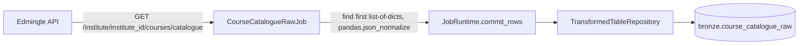

# Course Catalogue Raw Job

## 1. Overview

`CourseCatalogueRawJob` (registered job name `courses_batches.course_catalogue_raw`) is
a direct, unreconciled port of the legacy standalone script
`course_catalogue_data (1).py`. It performs a single GET against the institute
catalogue endpoint, flattens whatever JSON shape comes back with `pandas.json_normalize`,
and writes each flattened row plus its full raw payload into `bronze.course_catalogue_raw`.
It lives at `api_scripts/courses_batches/course_catalogue_raw/`; the containing package
(`courses_batches`) was recently renamed from a misspelled `corses_batches` to the
correct `courses_batches` — the code itself is unaffected and already uses the correct
current paths and job names documented here.

**Current status: disabled, never run against the live API.** `bronze.course_catalogue_raw`
has 0 rows (confirmed via direct query on 2026-09-24), `system.collection_checkpoints`
has no row for this job, and `audit.pipeline_runs` has no entry for pipeline_name
`courses_batches.course_catalogue_raw`.

## 2. Purpose

This job preserves a raw, unopinionated, schema-agnostic mirror of the catalogue API
response (as flattened columns plus the original JSON payload), independent of the more
opinionated `course_batch_merge` and `catalogue` jobs. Per project decision (documented
in this job's own README), the three catalogue-domain Bronze tables
(`bronze.course_catalog`, `bronze.course_batch_merge`, `bronze.course_catalogue_raw`)
are deliberately left unreconciled — this table exists as a low-risk, faithful capture
of "whatever the catalogue endpoint actually returns," useful for debugging or future
reconciliation work, not as a curated business-ready table.

## 3. High-Level Data Flow



No Silver-layer consumer of `bronze.course_catalogue_raw` was found. `processing/silver/courses.py`
explicitly states this table "was never a candidate source" for `silver.courses` (that
table is sourced only from `bronze.course_batch_merge`), and no other file under
`processing/silver/` references `course_catalogue_raw`. The data flow therefore
terminates at Bronze.

## 4. Project / Repository Structure

```
api_scripts/
├── common/
│   ├── models.py
│   ├── runtime.py            # JobRuntime.commit_rows()
│   ├── api_client.py         # EdmingleApiClient
│   └── repositories.py       # TransformedTableRepository
├── runner.py                  # job_registry(), run_job()
└── courses_batches/
    └── course_catalogue_raw/
        ├── __init__.py
        ├── README.md
        ├── course_catalogue_raw.py   # CourseCatalogueRawJob
        └── COURSE_CATALOGUE_RAW.md   # this file
shared/config/settings.py
services/scheduler/jobs.example.yaml
```

## 5. Source System

| Source | Type | Endpoint | HTTP Method | Authentication | Parameters | Pagination | Rate Limit |
|---|---|---|---|---|---|---|---|
| Edmingle catalogue | REST/JSON | `/institute/{institute_id}/courses/catalogue` | GET | `apikey` + `ORGID` headers (`EdmingleSettings`) | `institution_id` | None — single, unretried-by-design call (the shared client's retry/backoff still applies underneath, but the request itself is not paginated) | Shared `EdmingleApiClient` rate limiter |

## 6. Extraction Process

1. Require `EDMINGLE_INSTITUTE_ID`; raise `ValueError` if missing.
2. Single `runtime.client.get_json()` call to the catalogue endpoint.
3. `_find_first_list_of_dicts(payload)` recursively walks the JSON response and returns
   the first list whose every element is a dict (or `None` if none found).
4. `pandas.json_normalize()` flattens that list (or the whole payload, if no list was
   found) into a DataFrame with dynamic, unknown-ahead-of-time columns.
5. Each flattened row is serialized to canonical JSON (`sort_keys=True, default=str`),
   SHA-256 hashed, and its best-effort `bundle_id` extracted.

## 7. Detailed Function Documentation

| Function | Responsibility |
|---|---|
| `CourseCatalogueRawJob.run(runtime, checkpoint)` | Fetches the catalogue, flattens it, builds rows, and calls `commit_rows()` once. |
| `_find_first_list_of_dicts(obj)` | Recursive search: returns the first list where every element is a `dict`; recurses into dict values otherwise. Ported unchanged from the legacy script. |
| `_extract_bundle_id(row)` | Checks `"Bundle id"`, `"bundle_id"`, `"_id"`, `"id"` in that fixed priority order; returns the first non-null value found, else `None`. No other heuristics are applied. |

## 8. Input Parameters & Configuration

| Env var | Required | Default | Notes |
|---|---|---|---|
| `EDMINGLE_INSTITUTE_ID` | Yes | — | Job raises `ValueError` if unset/blank. |
| `EDMINGLE_ORGANIZATION_ID` | Yes (via `EdmingleSettings`) | — | Used for the `ORGID` header. |
| `EDMINGLE_API_KEY` | Yes | — | Sent as `apikey` header. |
| `EDMINGLE_API_BASE_URL` | No | `https://vyoma-api.edmingle.com/nuSource/api/v1` | |

No job-specific configuration exists beyond the shared `EdmingleSettings`.

## 9. Data Transformation

The transform is intentionally minimal and generic: find the first list-of-dicts
anywhere in the response, flatten it with `pandas.json_normalize()` (which turns nested
objects into dotted-path columns), then for each flattened row compute a canonical JSON
serialization, its SHA-256 hash, and a best-effort `bundle_id`. There is no filtering,
casting, or business-rule logic — every column the API happens to return is preserved
as-is inside the `raw_payload` JSONB blob, and only `bundle_id` and `row_sha256` are
extracted as first-class columns.

## 10. Output Dataset

Table: `bronze.course_catalogue_raw`. One row per flattened catalogue record per run.
Full-refresh: the checkpoint records only `{"completed_at", "row_count"}` — there is no
incremental state.

## 11. Output Schema

Confirmed live via `psql -c "\d bronze.course_catalogue_raw"` on 2026-09-24:

| Column | Data Type | Description | Source/Derived |
|---|---|---|---|
| `id` | bigint (identity) | Surrogate primary key | Generated by Postgres |
| `pipeline_run_id` | uuid, not null, FK → `audit.pipeline_runs(id)` | Run that wrote the row | `JobRuntime` |
| `bundle_id` | text | Best-effort identity value | Derived: first present of `Bundle id` / `bundle_id` / `_id` / `id` |
| `row_sha256` | text, not null, `CHECK (length = 64)` | SHA-256 of the row's canonical JSON | Derived |
| `raw_payload` | jsonb, not null | Full flattened row, as JSON | API (flattened) |
| `received_at` | timestamptz, not null | When the row was received | `TransformedTableRepository` |
| `created_at` | timestamptz, not null, default `now()` | Row insert time | Postgres default |

Constraints: `PRIMARY KEY (id)`; `UNIQUE (bundle_id, row_sha256)`;
`CHECK (length(row_sha256) = 64)`; FK `pipeline_run_id` → `audit.pipeline_runs(id)`.

## 12. Data Quality & Validation

- The only structural validation is `_find_first_list_of_dicts`; if the API response
  shape changes entirely (no list-of-dicts anywhere), `pandas.json_normalize()` is
  called on the raw payload dict itself as a fallback, which will still produce *some*
  output rather than raising.
- `row_sha256` is a genuine content hash, guarded by a DB-level `CHECK` constraint on
  length, providing a cheap way to detect whether a given flattened row's content has
  changed between runs.
- No explicit row-rejection logic exists in this job — every flattened row is written.

## 13. Error Handling & Logging

- Relies entirely on the shared `EdmingleApiClient.get_json()` for HTTP-level error
  handling (`ApiRequestError` on 400/401/403/404 or exhausted retries;
  `ApiContractError` on non-dict JSON or embedded Edmingle error codes 6001/6002).
- No job-specific exception types are raised beyond the institute-ID `ValueError` check.
- Standard `logging` via `warehouse.job`/`warehouse.api`/`warehouse.runner` loggers, same
  pattern as every other job (see section 13 of `COURSE_BATCH_MERGE.md` for the shared
  success/failure logging contract in `runner.run_job()`).

## 14. Dependencies

- Python: `pandas` (for `json_normalize`), `psycopg2` (`Json` type for payload storage).
- Internal: `api_scripts.common.{repositories,runtime}`, `shared.config`.
- No dependency on any other job's Bronze table.

## 15. Setup

1. Set `EDMINGLE_API_KEY`, `EDMINGLE_ORGANIZATION_ID`, `EDMINGLE_INSTITUTE_ID`, and the
   `WAREHOUSE_DB_*` variables in the environment (variable names only — no values are
   reproduced here).
2. Run `python warehouse_cli.py migrate` so `bronze.course_catalogue_raw` exists.

## 16. How to Run

Exact registered job-name string, confirmed from `api_scripts/runner.py::job_registry()`:
**`courses_batches.course_catalogue_raw`**.

```bash
python warehouse_cli.py collect courses_batches.course_catalogue_raw
```

## 17. Database / Warehouse Integration

- **Schema/table**: `bronze.course_catalogue_raw` (see section 11).
- **Checkpoint mechanism**: `system.collection_checkpoints`, keyed on
  `(job_name="courses_batches.course_catalogue_raw", partition_key="default")`, storing
  `{"completed_at", "row_count"}`. Confirmed via query: **0 rows currently exist** for
  this job.
- **Audit trail**: `audit.pipeline_runs` / `audit.events` via `RunRepository` and
  `TransformedTableRepository`. Confirmed via query: **no rows exist in
  `audit.pipeline_runs` for `pipeline_name = 'courses_batches.course_catalogue_raw'`**.
- **Upsert behavior**: `INSERT ... ON CONFLICT (bundle_id, row_sha256) DO NOTHING`-style
  update via `TransformedTableRepository` — since `bundle_id` and `row_sha256` together
  are the only non-generated columns beyond `raw_payload`, and `raw_payload` is itself
  updated on conflict (all columns other than the unique columns are included in the
  `DO UPDATE SET` clause per `TransformedTableRepository`'s generic logic).
- **Primary/unique keys**: `id` (surrogate PK), `UNIQUE (bundle_id, row_sha256)`.

## 18. Automation / Scheduling

Confirmed from `services/scheduler/jobs.example.yaml`: entry
`courses_batches_course_catalogue_raw_weekly` (`job_key: courses_batches.course_catalogue_raw`,
`interval_minutes: 10080`) exists with **`is_enabled: false`**. Confirmed from
`shared/config/settings.py`: `WarehouseSettings.scheduler_enabled` defaults `False`.
Confirmed on the VPS: no scheduler systemd unit or process was found; the only crontab
entry present runs `python warehouse_cli.py transform enrollments` (unrelated Silver
transform) every minute. **The scheduler service is not currently deployed, and this
job is not invoked by any automation on the VPS.**

## 19. Data Lineage

`Edmingle API (catalogue endpoint)` → `CourseCatalogueRawJob` (flatten only, no
business logic) → `bronze.course_catalogue_raw`. No Silver or Gold consumer was found in
the current implementation; this table is explicitly documented (in
`processing/silver/courses.py` and this job's own README) as intentionally
unreconciled with the other two catalogue-domain Bronze tables.

## 20. Important Business / Technical Rules

- No business rules are applied — this is a faithful, generic flatten of whatever the
  API returns.
- `bundle_id` extraction uses a fixed priority order and stops at the first non-null
  match; it is documented as the *only* extraction heuristic, deliberately not extended.
- Column set is dynamic and can change between runs if the API response shape changes,
  since `pandas.json_normalize()` derives columns from the data itself — but this only
  affects the JSONB `raw_payload` contents, not the fixed 3-column table schema.

## 21. Known Limitations

### Confirmed limitations
- **Disabled / never run against the live API.** Confirmed by: `bronze.course_catalogue_raw`
  row count = 0; no row in `system.collection_checkpoints` for this job; no row in
  `audit.pipeline_runs` for `pipeline_name = 'courses_batches.course_catalogue_raw'`;
  `is_enabled: false` in `services/scheduler/jobs.example.yaml`.
- **No reconciliation with `bronze.course_catalog` or `bronze.course_batch_merge`** —
  explicitly a project decision, not an oversight, per this job's README.
- **No Silver consumer** — confirmed by inspecting `processing/silver/courses.py`
  (explicitly excludes this table as a candidate source) and by finding no other
  reference to `course_catalogue_raw` under `processing/`.
- Single unretried-by-design GET (beyond the shared client's built-in retry/backoff): a
  transient partial response would not be cross-validated against a second call.

### Requires confirmation
- Whether this table is intended to ever feed a future reconciliation effort, or is
  purely a debugging/audit artifact, requires confirmation from the project owner.

## 22. Troubleshooting

| Symptom | Likely cause | Where to look |
|---|---|---|
| `ValueError: EDMINGLE_INSTITUTE_ID is required...` | Env var missing | `.env` / deployment environment |
| Job succeeds but `raw_payload` looks wrong/empty | API response shape changed and `_find_first_list_of_dicts` fell back to flattening the whole payload | Inspect a sample `raw_payload` row; compare to a manual API call |
| `ApiRequestError`/`ApiContractError` | HTTP or application-level API failure | `EDMINGLE_API_KEY`/`EDMINGLE_ORGANIZATION_ID` correctness, API status |

## 23. Maintenance Guide

- If the catalogue endpoint's response shape changes such that no list-of-dicts is
  present anywhere, verify `_find_first_list_of_dicts`'s fallback behavior still
  produces sensible flattened rows.
- Because `bundle_id` extraction is a fixed, documented heuristic, do not add ad hoc
  extra key names without updating both the code and this document together.

## 24. Upstream & Downstream Dependencies

- **Upstream**: Edmingle catalogue endpoint only.
- **Downstream**: none identified. Confirmed unreconciled/unused by any Silver transform
  in `processing/silver/`.

## 25. Security Considerations

- Credentials handled identically to every other job — environment-variable only, never
  logged (see `EdmingleSettings.redacted_summary()`).
- `raw_payload` stores the full API response verbatim; if the catalogue API ever returns
  PII beyond course metadata, it would be captured here unfiltered — worth flagging to
  the project owner if the catalogue endpoint's content ever changes to include such
  fields.

## 26. Change Log

| Date | Version | Author | Description |
|---|---|---|---|

## 27. Ownership

Requires confirmation from the project owner.
