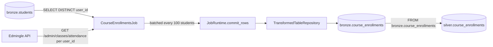

# Course Enrollments Job

## 1. Overview

`CourseEnrollmentsJob` (registered job name `ela_mis_datasets.course_enrollments`) is
the course/attendance half of the legacy standalone script
`edmingle_student_course_sync.py` (the student-roster half is ported separately as
`ela_mis_datasets.students`, see `STUDENTS.md`). For every eligible student, it calls
`GET /admin/classes/attendance` and writes each returned class/attendance-summary row
into `bronze.course_enrollments`.

**Current status: disabled, never run against the live API.** `bronze.course_enrollments`
has 0 rows (confirmed via direct query on 2026-09-24), `system.collection_checkpoints`
has no row for this job, and `audit.pipeline_runs` has no entry for pipeline_name
`ela_mis_datasets.course_enrollments`. It is also functionally blocked today because its
required upstream table, `bronze.students`, is itself empty (see section 24).

## 2. Purpose

This job produces a per-(student, class) attendance/enrollment summary table, distinct
from Edmingle's own enrollment-event report (`bronze.enrollment_reports`, a different
endpoint and a different job — see `ENROLLMENTS_REPORTS.md`). It exists so downstream
Silver reporting on class-level attendance/enrollment summaries has a dedicated,
structured source instead of the legacy script's CSV output.

## 3. High-Level Data Flow



Confirmed by reading `processing/silver/course_enrollments.py`: its `_SELECT_SQL` reads
`FROM bronze.course_enrollments WHERE user_id IS NOT NULL AND class_id IS NOT NULL`,
upserting into `silver.course_enrollments` on `(user_id, class_id)`. This is a genuine,
confirmed downstream relationship — `bronze.course_enrollments` is `silver.course_enrollments`'s
only source table (single-source, no reconciliation needed, per that file's own
docstring).

## 4. Project / Repository Structure

```
api_scripts/
├── common/                    # shared framework (see COURSE_BATCH_MERGE.md section 4)
├── runner.py                   # job_registry(), run_job()
└── ela_mis_datasets/
    ├── students/                # upstream job this one depends on
    └── course_enrollments/
        ├── __init__.py
        ├── README.md
        ├── course_enrollments.py   # CourseEnrollmentsJob
        └── COURSE_ENROLLMENTS.md   # this file
processing/silver/course_enrollments.py   # confirmed downstream Silver transform
shared/config/settings.py
shared/database.py
services/scheduler/jobs.example.yaml
```

## 5. Source System

| Source | Type | Endpoint | HTTP Method | Authentication | Parameters | Pagination | Rate Limit |
|---|---|---|---|---|---|---|---|
| Edmingle student attendance | REST/JSON | `/admin/classes/attendance` | GET | `apikey` + `ORGID` headers | `user_id`, `response_type=1` | None per call (one call returns all of a student's classes); the job iterates one call per eligible student instead | Shared `EdmingleApiClient` rate limiter |
| Internal (not Edmingle) | Postgres | `bronze.students` | `SELECT` | Warehouse DB credentials (`WAREHOUSE_DB_*`) | `SELECT DISTINCT user_id FROM bronze.students WHERE user_id IS NOT NULL AND user_id <> 'NA' ORDER BY user_id` | N/A | N/A |

## 6. Extraction Process

1. `_load_eligible_user_ids()` opens its own short-lived `Database` connection
   (separate from the `JobRuntime`'s write path) and queries
   `bronze.students` for distinct, non-null, non-`'NA'` `user_id`s, ordered for a
   stable, repeatable resume sequence.
2. Resume from `checkpoint.get("students_processed", 0)`; if that value is out of range
   for the current `user_id` list (e.g. `bronze.students` shrank or changed shape
   between runs), it safely resets to `0` rather than skipping/erroring.
3. For each remaining `user_id`, call `GET /admin/classes/attendance` with
   `response_type=1`; validate the `classes` list via `require_record_list()`.
4. Map each class entry to a row via `_build_row()`; rows without a `class_id` are
   dropped (the target column is `NOT NULL`).
5. Every 100 students (`STUDENTS_PER_BATCH`) — or at the very last student — commit the
   accumulated rows via `runtime.commit_rows()` and update the checkpoint.

## 7. Detailed Function Documentation

| Function | Responsibility |
|---|---|
| `CourseEnrollmentsJob.run(runtime, checkpoint)` | Orchestrates the per-student fetch/batch/commit loop described above. |
| `CourseEnrollmentsJob._load_eligible_user_ids()` | Opens a standalone `Database` connection to read distinct eligible `user_id`s from `bronze.students`. |
| `_build_row(user_id, course)` | Maps one `classes` entry to a `bronze.course_enrollments` row tuple; returns `None` if `class_id` is missing/blank. |
| `_text(value)` / `_numeric(value)` | Null-safe casters: empty string/`None` → `None`. |

## 8. Input Parameters & Configuration

| Env var | Required | Default | Notes |
|---|---|---|---|
| `EDMINGLE_ORGANIZATION_ID` | Yes (via `EdmingleSettings`) | — | Used for the `ORGID` header. |
| `EDMINGLE_API_KEY` | Yes | — | |
| `WAREHOUSE_DB_*` | Yes | — | Needed twice: once by the runner's own `Database`, and once by this job's own `_load_eligible_user_ids()` connection. |

`STUDENTS_PER_BATCH = 100` is a hardcoded constant in `course_enrollments.py`, not an
env var — a transaction-overhead batching choice, not a fidelity requirement.

## 9. Data Transformation

Each `classes` entry returned by `/admin/classes/attendance` is mapped 1:1 onto the 23
`COLUMNS` of `bronze.course_enrollments` (class metadata, `total_classes`,
`present`/`absent`/`late`/`excused` counts renamed to `*_count` columns, batch/master-batch
identifiers, and status fields). Unlike the original script, `name`/`email` are **not**
joined in from a student-master row — they are populated only if
`/admin/classes/attendance` itself includes those fields on a class row; otherwise they
are left `NULL` (documented fidelity gap versus the original, explained in the job's
own README because `bronze.students` may hold more than one historical row per
`user_id` and there is no unambiguous row to join against).

## 10. Output Dataset

Table: `bronze.course_enrollments`. One row per `(user_id, class_id)` pair, upserted
in batches of up to 100 students' worth of rows per commit.

## 11. Output Schema

Confirmed live via `psql -c "\d bronze.course_enrollments"` on 2026-09-24:

| Column | Data Type | Description | Source/Derived |
|---|---|---|---|
| `id` | bigint (identity) | Surrogate primary key | Generated by Postgres |
| `pipeline_run_id` | uuid, not null, FK → `audit.pipeline_runs(id)` | Run that wrote/last-touched the row | `JobRuntime` |
| `user_id` | text, not null | Student identifier | `bronze.students` lookup |
| `name` | text | Student name (only if present on the class row) | API |
| `email` | text | Student email (only if present on the class row) | API |
| `class_id` | text, not null | Class identifier | API |
| `class_name` | text | Class name | API |
| `tutor_name` | text | Tutor name | API |
| `total_classes` | numeric | Total scheduled classes | API |
| `present_count` | numeric | Present count | API: `present` |
| `absent_count` | numeric | Absent count | API: `absent` |
| `late_count` | numeric | Late count | API: `late` |
| `excused_count` | numeric | Excused count | API: `excused` |
| `start_date` | text | Class start date (raw, unparsed) | API |
| `end_date` | text | Class end date (raw, unparsed) | API |
| `master_batch_id` | text | Master batch identifier | API |
| `master_batch_name` | text | Master batch name | API |
| `classusers_start_date` | text | Class-user start date (raw, unparsed) | API |
| `classusers_end_date` | text | Class-user end date (raw, unparsed) | API |
| `batch_status` | text | Batch status | API |
| `cu_status` | text | Class-user status | API |
| `cu_state` | text | Class-user state | API |
| `institution_bundle_id` | text | Institution bundle identifier | API |
| `archived_at` | text | Archive timestamp (raw, unparsed) | API |
| `bundle_id` | text | Bundle identifier | API |
| `received_at` | timestamptz, not null | When the row was received | `TransformedTableRepository` |
| `created_at` | timestamptz, not null, default `now()` | Row insert time | Postgres default |

Constraints: `PRIMARY KEY (id)`; `UNIQUE (user_id, class_id)`; FK `pipeline_run_id` →
`audit.pipeline_runs(id)`.

## 12. Data Quality & Validation

- `require_record_list()` validates the `classes` key on each response is a list of
  dicts.
- Rows missing `class_id` (`NOT NULL` on the target column) are dropped individually
  rather than failing the whole batch for that student.
- If `bronze.students` is empty, the job commits a single empty batch and a checkpoint
  of `{"students_processed": 0}` and exits cleanly — "does no harm, it just does
  nothing" per the job's own README.
- The `already_processed` resume index is bounds-checked against the current
  `user_id` list length on every run, guarding against index-out-of-range or silent
  skips if the upstream student list shrinks or is re-derived differently.

## 13. Error Handling & Logging

- Relies on the shared `EdmingleApiClient.get_json()` for HTTP/application-level error
  handling.
- `require_record_list()` raises `ApiContractError` on a malformed `classes` response.
- The job's own DB lookup (`_load_eligible_user_ids`) opens and closes its own
  `Database` connection independent of the runtime's write path; a failure there (e.g.
  DB unavailable) propagates as an unhandled exception, causing `runner.run_job()` to
  mark the run `FAILED`.
- Standard `logging` / audit contract identical to every other job (see
  `COURSE_BATCH_MERGE.md` section 13).

## 14. Dependencies

- Python: `requests` (via `EdmingleApiClient`), `psycopg2` (via `Database`/
  `TransformedTableRepository`).
- Internal: `api_scripts.common.{edmingle,repositories,runtime}`, `shared.config`,
  `shared.database`.
- **Hard upstream dependency: `bronze.students` must already be populated** (i.e. the
  `ela_mis_datasets.students` job must have run successfully first) for this job to do
  anything besides commit an empty batch.

## 15. Setup

1. Run `ela_mis_datasets.students` first (see `STUDENTS.md`) so `bronze.students` has
   eligible `user_id`s.
2. Set `EDMINGLE_API_KEY`, `EDMINGLE_ORGANIZATION_ID`, and `WAREHOUSE_DB_*` in the
   environment (names only, no values reproduced here).
3. Run `python warehouse_cli.py migrate` so `bronze.course_enrollments` exists.

## 16. How to Run

Exact registered job-name string, confirmed from `api_scripts/runner.py::job_registry()`:
**`ela_mis_datasets.course_enrollments`**.

```bash
python warehouse_cli.py collect ela_mis_datasets.course_enrollments
```

## 17. Database / Warehouse Integration

- **Schema/table**: `bronze.course_enrollments` (see section 11).
- **Checkpoint mechanism**: `system.collection_checkpoints`, keyed on
  `(job_name="ela_mis_datasets.course_enrollments", partition_key="default")`, storing
  `{"students_processed": N, "updated_at": ...}` — a genuine resume mechanism (unlike
  `students`' checkpoint, this one **is** used to pick up where a previous run left
  off, since a full re-run of every student's attendance could be expensive). Confirmed
  via query: **0 rows currently exist in `system.collection_checkpoints`** for this job.
- **Audit trail**: `audit.pipeline_runs` / `audit.events` via `RunRepository`. Confirmed
  via query: **no rows exist in `audit.pipeline_runs` for
  `pipeline_name = 'ela_mis_datasets.course_enrollments'`**.
- **Upsert behavior**: `INSERT ... ON CONFLICT (user_id, class_id) DO UPDATE SET <every
  other column>`.
- **Primary/unique keys**: `id` (surrogate PK), `UNIQUE (user_id, class_id)`.

## 18. Automation / Scheduling

Confirmed from `services/scheduler/jobs.example.yaml`: entry
`ela_mis_datasets_course_enrollments_weekly` (`job_key: ela_mis_datasets.course_enrollments`,
`interval_minutes: 10080`) exists with **`is_enabled: false`**. Confirmed from
`shared/config/settings.py`: `WarehouseSettings.scheduler_enabled` defaults `False`.
Confirmed on the VPS: no scheduler systemd unit or process was found; the only crontab
entry present runs `python warehouse_cli.py transform enrollments` every minute — an
unrelated Silver transform (see `ENROLLMENTS_REPORTS.md`), not this job. **The
scheduler service is not currently deployed, and this job is not invoked by any
automation on the VPS.**

## 19. Data Lineage

`bronze.students` (upstream job output) + `Edmingle API (/admin/classes/attendance)` →
`CourseEnrollmentsJob` → `bronze.course_enrollments` → `silver.course_enrollments`
(confirmed via `processing/silver/course_enrollments.py`'s `_SELECT_SQL`). No Gold-layer
consumer was identified in the current implementation.

## 20. Important Business / Technical Rules

- This job will not produce any rows unless `bronze.students` already has eligible
  `user_id`s — it is explicitly designed to depend on that upstream job's output table
  rather than re-deriving the student list itself (documented pattern, matching
  `class_id_lookup` depending on `catalogue` elsewhere in this codebase).
- Checkpointing here **is** a true incremental-resume mechanism (unique among the jobs
  in this document set) — `students_processed` genuinely gates which students are
  re-fetched on the next run.
- `name`/`email` are deliberately left `NULL` unless present directly on the class row —
  a documented, intentional fidelity gap versus the legacy script.

## 21. Known Limitations

### Confirmed limitations
- **Disabled / never run against the live API.** Confirmed by: `bronze.course_enrollments`
  row count = 0; no row in `system.collection_checkpoints` for this job; no row in
  `audit.pipeline_runs` for `pipeline_name = 'ela_mis_datasets.course_enrollments'`;
  `is_enabled: false` in `services/scheduler/jobs.example.yaml`.
- **Functionally blocked on its upstream dependency today** — `bronze.students` also
  has 0 rows (confirmed), so even if this job were run manually right now it would
  process zero students and commit an empty batch.
- One API call per eligible student — for a large student roster, this could be a
  high-request-volume, long-running job; no measured runtime exists since it has never
  been executed.

### Requires confirmation
- Whether `name`/`email` are ever actually present on `/admin/classes/attendance`
  responses (making the documented fidelity gap moot in practice) has not been verified
  against a live API sample, since the job has never run.

## 22. Troubleshooting

| Symptom | Likely cause | Where to look |
|---|---|---|
| Job commits an empty batch immediately | `bronze.students` is empty | Run `ela_mis_datasets.students` first |
| `ApiContractError: ...did not contain a valid 'classes' record list` | Unexpected response shape for a given `user_id` | API status, spot-check that `user_id` manually |
| Resume picks up from an unexpected student index | Checkpoint from a prior run against a differently-shaped `bronze.students` | Checkpoint auto-resets to `0` if out of range — verify via `system.collection_checkpoints` |

## 23. Maintenance Guide

- If `bronze.students`' eligibility filter changes (currently
  `user_id IS NOT NULL AND user_id <> 'NA'`), keep this job's query in sync manually —
  it is duplicated, not shared, code.
- If `bronze.course_enrollments`' schema changes, update `COLUMNS` in
  `course_enrollments.py` to match exactly (order must match `_build_row()`'s tuple
  order).

## 24. Upstream & Downstream Dependencies

- **Upstream**: `bronze.students` (hard dependency, confirmed via
  `_load_eligible_user_ids()`); Edmingle `/admin/classes/attendance` endpoint.
- **Downstream**: `silver.course_enrollments`, confirmed via
  `processing/silver/course_enrollments.py`'s `_SELECT_SQL`
  (`FROM bronze.course_enrollments WHERE user_id IS NOT NULL AND class_id IS NOT NULL`),
  upserting on `(user_id, class_id)` into `silver.course_enrollments`.

## 25. Security Considerations

- Student PII (`name`, `email`, when present) flows into `bronze.course_enrollments` in
  plaintext `text` columns.
- This job opens a second, independent database connection
  (`Database(DatabaseSettings.from_environment(), "course_enrollments-lookup")`) purely
  for the read-only `bronze.students` lookup — both connections use the same
  `WAREHOUSE_DB_*` credentials, but as two separate connection-pool entries.
- API/database credentials are environment-variable only, never logged.

## 26. Change Log

| Date | Version | Author | Description |
|---|---|---|---|

## 27. Ownership

Requires confirmation from the project owner.
