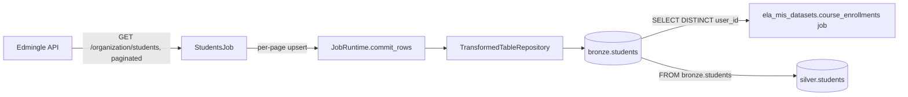

# Students Job

## 1. Overview

`StudentsJob` (registered job name `ela_mis_datasets.students`) collects the Edmingle
organization-wide student roster and writes it to `bronze.students`. It is one half of
the legacy standalone script `edmingle_student_course_sync.py`, which used to sync the
student roster and then, in the same ~68-80 hour run, walk every student to pull
course/class attendance. This job ports only the **student roster** half; the
**course/enrollment** half is ported separately as `ela_mis_datasets.course_enrollments`
(see `COURSE_ENROLLMENTS.md`).

**Current status: disabled, never run against the live API.** `bronze.students` has 0
rows (confirmed via direct query on 2026-09-24), `system.collection_checkpoints` has no
row for this job, and `audit.pipeline_runs` has no entry for pipeline_name
`ela_mis_datasets.students`.

## 2. Purpose

`bronze.students` is the canonical student-roster table for this project's MIS
(management information system) dataset domain, and is a hard upstream dependency for
`ela_mis_datasets.course_enrollments`, which reads the eligible `user_id` list straight
from this table (see section 24 and `COURSE_ENROLLMENTS.md`). Populating it is a
prerequisite for the enrollments job to do anything useful.

## 3. High-Level Data Flow



Confirmed by reading `processing/silver/students.py`: it selects `FROM bronze.students`
directly, so `bronze.students` feeds both the sibling `course_enrollments` **job**
(Bronze-to-Bronze) and the `silver.students` Silver transform.

## 4. Project / Repository Structure

```
api_scripts/
├── common/                    # shared framework (see COURSE_BATCH_MERGE.md section 4)
├── runner.py                   # job_registry(), run_job()
└── ela_mis_datasets/
    ├── students/
    │   ├── __init__.py
    │   ├── README.md
    │   ├── students.py         # StudentsJob
    │   └── STUDENTS.md         # this file
    └── course_enrollments/     # downstream consumer job
shared/config/settings.py
services/scheduler/jobs.example.yaml
```

## 5. Source System

| Source | Type | Endpoint | HTTP Method | Authentication | Parameters | Pagination | Rate Limit |
|---|---|---|---|---|---|---|---|
| Edmingle organization students | REST/JSON | `/organization/students` | GET | `apikey` + `ORGID` headers | `organization_id`, `is_archived=0`, `per_page`, `page` | Manual page loop; stops on the first page returning an empty `students` list | Shared `EdmingleApiClient` rate limiter (`EDMINGLE_MIN_REQUEST_INTERVAL_SECONDS`) |

## 6. Extraction Process

1. Determine `per_page` from `STUDENTS_PER_PAGE` (default `500`).
2. Loop `page = 1, 2, 3, ...`, calling `GET /organization/students` with
   `is_archived=0` each time.
3. `require_record_list(payload, "students", ...)` validates the response contains a
   `students` list.
4. An empty `students` list on any page signals the end of the roster; the loop breaks.
5. Each page's students are mapped to rows via `_student_row()` and committed
   immediately (`runtime.commit_rows()` per page) — not batched to the end — so a
   crash mid-run does not lose already-fetched pages.

## 7. Detailed Function Documentation

| Function | Responsibility |
|---|---|
| `StudentsJob.run(runtime, checkpoint)` | Pages through the roster endpoint, committing per page. The `checkpoint` argument is intentionally **not** used to pick a resume page — every run restarts from page 1 (see section 20). |
| `_students_per_page()` | Reads `STUDENTS_PER_PAGE` env var, falling back to `DEFAULT_STUDENTS_PER_PAGE = 500` on missing/invalid values. |
| `_student_row(student)` | Maps one API student record to a row tuple matching `COLUMNS`. Returns `None` (row skipped) if `user_id` is missing/blank. |
| `_custom_field_value(customfield_data, index)` | Position-based lookup into a student's `customfield_data` list; returns `None` for a short/missing list or non-dict entry. |
| `_text(value)` / `_bool_or_none(value)` | Null-safe casters: empty string/`None` → `None`; `_bool_or_none` also accepts `0`/`1`-style truthy ints. |

## 8. Input Parameters & Configuration

| Env var | Required | Default | Notes |
|---|---|---|---|
| `STUDENTS_PER_PAGE` | No | `500` | Job-specific; falls back to default on invalid/non-positive values. |
| `EDMINGLE_ORGANIZATION_ID` | Yes (via `EdmingleSettings`) | — | |
| `EDMINGLE_API_KEY` | Yes | — | |
| `EDMINGLE_API_BASE_URL` | No | `https://vyoma-api.edmingle.com/nuSource/api/v1` | |

## 9. Data Transformation

Each API student record is mapped 1:1 into the 26 `COLUMNS` listed in `students.py`
(`user_id`, `name`, `email`, phone/parent fields, registration fields, `role`,
`status`, etc.), all passed through the null-safe `_text()`/`_bool_or_none()` casters.
Four additional columns (`custom_phone_number`, `custom_age`, `custom_last_name`,
`custom_user_name`) are extracted from the student's `customfield_data` list **by
fixed position**, copied verbatim from the original script's
`index_mapping = {"PhoneNumber": 19, "Age": 9, "LastName": 6, "UserName": 0}`. Rows
with no usable `user_id` are dropped (returns `None` from `_student_row`) since
`user_id` is `NOT NULL`/`UNIQUE` on the target table.

## 10. Output Dataset

Table: `bronze.students`. One row per unique `user_id`, upserted on every run
(last-write-wins). Rows are committed once per fetched page.

## 11. Output Schema

Confirmed live via `psql -c "\d bronze.students"` on 2026-09-24:

| Column | Data Type | Description | Source/Derived |
|---|---|---|---|
| `id` | bigint (identity) | Surrogate primary key | Generated by Postgres |
| `pipeline_run_id` | uuid, not null, FK → `audit.pipeline_runs(id)` | Run that wrote/last-touched the row | `JobRuntime` |
| `user_id` | text, not null | Edmingle user identifier | API |
| `name` | text | Student name | API |
| `email` | text | Student email | API |
| `contact_number` | text | Primary contact number | API |
| `contact_number_2` | text | Secondary contact number | API |
| `contact_number_2_country_id` | text | Country ID for secondary contact | API |
| `contact_number_2_dial_code` | text | Dial code for secondary contact | API |
| `contact_number_country_id` | text | Country ID for primary contact | API |
| `contact_number_dial_code` | text | Dial code for primary contact | API |
| `registration_date` | text | Raw registration date (API `date`) | API |
| `formatted_registration_date` | text | API `formatted_date` | API |
| `is_archived` | boolean | Archived flag | API |
| `parent_contact_number` | text | Parent contact number | API |
| `parent_contact_number_country_id` | text | Country ID for parent contact | API |
| `parent_contact_number_dial_code` | text | Dial code for parent contact | API |
| `parent_email` | text | Parent email | API |
| `parent_name` | text | Parent name | API |
| `registration_number` | text | Registration number | API |
| `role` | text | User role | API |
| `status` | text | Status | API |
| `registration_time` | text | API `time` field | API |
| `user_username` | text | Username | API |
| `custom_phone_number` | text | Custom field `PhoneNumber` | `customfield_data[19].field_value` |
| `custom_age` | text | Custom field `Age` | `customfield_data[9].field_value` |
| `custom_last_name` | text | Custom field `LastName` | `customfield_data[6].field_value` |
| `custom_user_name` | text | Custom field `UserName` | `customfield_data[0].field_value` |
| `received_at` | timestamptz, not null | When the row was received | `TransformedTableRepository` |
| `created_at` | timestamptz, not null, default `now()` | Row insert time | Postgres default |

Constraints: `PRIMARY KEY (id)`; `UNIQUE (user_id)`; FK `pipeline_run_id` →
`audit.pipeline_runs(id)`.

## 12. Data Quality & Validation

- `require_record_list()` validates the `students` key is present and is a list of
  dicts before processing each page.
- Rows without a usable `user_id` are silently skipped (returns `None`), since the
  column is `NOT NULL`/`UNIQUE` — this prevents one malformed record from failing an
  entire page's commit.
- `customfield_data` position lookups guard against short lists, missing indices, and
  non-dict entries, defaulting to `None` rather than raising `IndexError`/`KeyError`.
- No duplicate-detection beyond the `UNIQUE (user_id)` upsert — a student appearing
  twice across pages (unlikely, but possible under concurrent roster edits) simply
  results in the second occurrence overwriting the first.

## 13. Error Handling & Logging

- Relies on the shared `EdmingleApiClient.get_json()` for HTTP/application-level error
  handling (`ApiRequestError`, `ApiContractError`).
- `require_record_list()` raises `ApiContractError` if the `students` key is missing or
  not a list of dicts.
- Standard `logging` via `warehouse.job`/`warehouse.api`/`warehouse.runner`, following
  the same success/failure contract as every other job in `runner.run_job()` (see
  `COURSE_BATCH_MERGE.md` section 13 for the shared pattern).

## 14. Dependencies

- Python: `requests` (via `EdmingleApiClient`), `psycopg2` (via `TransformedTableRepository`).
- Internal: `api_scripts.common.{edmingle,repositories,runtime}`, `shared.config`.
- No dependency on any other job's Bronze table (this job is a pure API source).

## 15. Setup

1. Set `EDMINGLE_API_KEY`, `EDMINGLE_ORGANIZATION_ID`, and the `WAREHOUSE_DB_*`
   variables (names only, no values reproduced here). Optionally set
   `STUDENTS_PER_PAGE`.
2. Run `python warehouse_cli.py migrate` so `bronze.students` exists.

## 16. How to Run

Exact registered job-name string, confirmed from `api_scripts/runner.py::job_registry()`:
**`ela_mis_datasets.students`**.

```bash
python warehouse_cli.py collect ela_mis_datasets.students
```

Should generally be run before `ela_mis_datasets.course_enrollments`, since that job
reads its eligible user list from this job's output table.

## 17. Database / Warehouse Integration

- **Schema/table**: `bronze.students` (see section 11).
- **Checkpoint mechanism**: `system.collection_checkpoints`, keyed on
  `(job_name="ela_mis_datasets.students", partition_key="default")`. The checkpoint
  payload — `{"last_page_fetched", "total_students_seen", "updated_at"}` — is
  informational only; it is **not used to resume a partial run** (every run restarts
  from page 1, relying on the idempotent upsert instead). Confirmed via query: **0 rows
  currently exist in `system.collection_checkpoints`** for this job.
- **Audit trail**: `audit.pipeline_runs` / `audit.events` via `RunRepository`. Confirmed
  via query: **no rows exist in `audit.pipeline_runs` for
  `pipeline_name = 'ela_mis_datasets.students'`**.
- **Upsert behavior**: `INSERT ... ON CONFLICT (user_id) DO UPDATE SET <every other
  column>` — last-write-wins per `user_id`, reproducing the original script's
  `merge_students()` dedupe behavior as a database upsert.
- **Primary/unique keys**: `id` (surrogate PK), `UNIQUE (user_id)`.

## 18. Automation / Scheduling

Confirmed from `services/scheduler/jobs.example.yaml`: entry
`ela_mis_datasets_students_weekly` (`job_key: ela_mis_datasets.students`,
`interval_minutes: 10080`) exists with **`is_enabled: false`**. Confirmed from
`shared/config/settings.py`: `WarehouseSettings.scheduler_enabled` defaults `False`.
Confirmed on the VPS: no scheduler systemd unit or process was found; the only crontab
entry present runs `python warehouse_cli.py transform enrollments` every minute — an
unrelated Silver transform, not this job. **The scheduler service is not currently
deployed, and this job is not invoked by any automation on the VPS.**

## 19. Data Lineage

`Edmingle API (/organization/students)` → `StudentsJob` → `bronze.students` → two
confirmed downstream consumers: (1) the `ela_mis_datasets.course_enrollments` job
(Bronze-to-Bronze), which reads
`SELECT DISTINCT user_id FROM bronze.students WHERE user_id IS NOT NULL AND user_id <> 'NA'`;
and (2) `processing/silver/students.py`, confirmed via its own `_SELECT_SQL` reading
`FROM bronze.students`, feeding `silver.students`.

## 20. Important Business / Technical Rules

- **No page-overlap resume.** The original script tracked `last_completed_student_page`
  and re-fetched an overlap window on each run, because a single run took days and wrote
  to a CSV with no per-row upsert guarantee. This port deliberately simplifies that away:
  every run starts at page 1 and relies on `ON CONFLICT (user_id) DO UPDATE` to make a
  full re-fetch safe and self-healing. This is a documented, intentional simplification,
  not an oversight.
- Custom field extraction is strictly positional (`customfield_data[index]`), not by
  field name — a change in field ordering upstream would silently produce wrong values
  rather than raising an error.
- `is_archived=0` is hardcoded in the request; archived students are never fetched by
  this job.

## 21. Known Limitations

### Confirmed limitations
- **Disabled / never run against the live API.** Confirmed by: `bronze.students` row
  count = 0; no row in `system.collection_checkpoints` for this job; no row in
  `audit.pipeline_runs` for `pipeline_name = 'ela_mis_datasets.students'`;
  `is_enabled: false` in `services/scheduler/jobs.example.yaml`.
- **Downstream `course_enrollments` job is non-functional until this job populates
  `bronze.students`** — confirmed by reading `course_enrollments.py`'s
  `_load_eligible_user_ids()`, which queries `bronze.students` directly.
- Positional custom-field extraction is fragile to upstream field-ordering changes;
  documented as a known, accepted risk in the job's own code comments.

### Requires confirmation
- Expected run duration/request volume against the live API is unmeasured, since the job
  has never run.

## 22. Troubleshooting

| Symptom | Likely cause | Where to look |
|---|---|---|
| Job commits 0 rows immediately | First page returned an empty `students` list | Verify `EDMINGLE_ORGANIZATION_ID`, check if the organization actually has active (non-archived) students |
| `ApiContractError: ...did not contain a valid 'students' record list` | Unexpected response shape | API status, response payload inspection |
| Downstream `course_enrollments` job processes 0 students | `bronze.students` is empty or all `user_id` values are `'NA'`/`NULL` | Confirm this job ran successfully first |

## 23. Maintenance Guide

- If Edmingle changes `customfield_data` ordering, the `CUSTOM_FIELD_INDEX` mapping must
  be updated in lock-step with the original script's own `index_mapping`, or the two
  will silently diverge.
- If `bronze.students` schema changes, update `COLUMNS` in `students.py` to match exactly
  (column order must match `_student_row()`'s tuple order).

## 24. Upstream & Downstream Dependencies

- **Upstream**: Edmingle `/organization/students` endpoint only.
- **Downstream**: `ela_mis_datasets.course_enrollments` job (confirmed, reads
  `bronze.students` directly via its own short-lived DB connection); `silver.students`
  via `processing/silver/students.py` (confirmed, `_SELECT_SQL` reads
  `FROM bronze.students`).

## 25. Security Considerations

- Student PII (name, email, phone numbers, parent contact info) flows through this job
  into `bronze.students` in plaintext `text` columns — standard for a Bronze layer, but
  worth noting for anyone scoping access controls or data-retention policy on this table.
- API/database credentials are environment-variable only, never logged (see
  `EdmingleSettings.redacted_summary()`).

## 26. Change Log

| Date | Version | Author | Description |
|---|---|---|---|

## 27. Ownership

Requires confirmation from the project owner.
