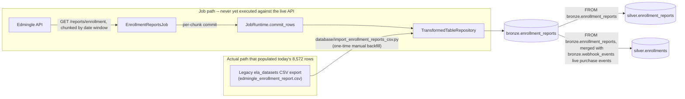

# Enrollment Reports Job

## 1. Overview

`EnrollmentReportsJob` lives in `api_scripts/enrollments_reports/enrollments_reports.py`
but is registered under the **singular** job name `enrollment_reports` — confirmed
directly from `api_scripts/runner.py::job_registry()`, which maps the registry key
`"enrollment_reports"` (not `"enrollments_reports"`) to `EnrollmentReportsJob`, and from
the class's own `name = "enrollment_reports"` attribute. It ports the legacy
`edmingle_export.py` / `edmingle_api.py` / `edmingle_chunker.py` scripts: a chunked,
date-windowed pull of Edmingle's row-level enrollment report, writing into
`bronze.enrollment_reports`.

**Critical distinction, verified directly against the database and the code:**
`bronze.enrollment_reports` currently holds **8,572 rows** — but confirmed via
`audit.pipeline_runs`, **zero of those rows came from this job actually running**. The
only recorded run against this table is `pipeline_name = 'enrollment_reports_csv_import'`
(`run_type = 'backfill'`, status `SUCCESS`, `started_at = 2026-09-23 19:55:15 UTC`,
`rows_read = 8572`, `rows_written = 8572`), executed by the standalone one-time script
`database/import_enrollment_reports_csv.py`, which loads a historical CSV export from
the legacy `ela_datasets` project (path referenced in that script's own docstring:
`/home/projectdev/ela_datasets/enrollments_reports/output/edmingle_enrollment_report.csv`).
There is **no** row in `audit.pipeline_runs` for `pipeline_name = 'enrollment_reports'`
(confirmed: `SELECT count(*) FROM audit.pipeline_runs WHERE pipeline_name = 'enrollment_reports'`
returns `0`), and **no** row in `system.collection_checkpoints` for this job. The
`EnrollmentReportsJob` documented here has never executed against the live Edmingle API.

## 2. Purpose

`bronze.enrollment_reports` is meant to hold Edmingle's own row-level, per-enrollment-
event report (distinct from `bronze.course_enrollments`, a per-student attendance
summary from a different endpoint — see `COURSE_ENROLLMENTS.md`). This job's purpose is
to keep that table current going forward by re-pulling `/reports/enrollment` in
date-windowed chunks; today, the table's actual content was instead seeded once, by
hand, from a historical CSV export produced by the legacy standalone `ela_datasets`
pipeline.

## 3. High-Level Data Flow



Both Silver edges are confirmed by reading source code, not assumed:
`processing/silver/enrollment_reports.py`'s `_SELECT_SQL` reads
`FROM bronze.enrollment_reports WHERE enrollment_id IS NOT NULL` into
`silver.enrollment_reports`; `processing/silver/enrollments.py`'s
`_upsert_from_enrollment_reports()` reads the same table (a slightly different column
subset) as one of its two upsert passes into `silver.enrollments`, the other pass being
`_upsert_from_webhook_transactions()` which merges in live
`transaction.user_purchase_completed` events from `bronze.webhook_events`. Both Silver
transforms have themselves been run — `audit.pipeline_runs` shows successful
`silver_enrollment_reports` and `silver_enrollments` runs — meaning today's Silver
tables were built from the manually-imported CSV data, not from any live-API run of
this job.

## 4. Project / Repository Structure

```
api_scripts/
├── common/                    # shared framework (see COURSE_BATCH_MERGE.md section 4)
├── runner.py                   # job_registry() maps "enrollment_reports" -> EnrollmentReportsJob
└── enrollments_reports/
    ├── __init__.py
    ├── README.md
    ├── enrollments_reports.py     # EnrollmentReportsJob
    └── ENROLLMENTS_REPORTS.md     # this file
database/
└── import_enrollment_reports_csv.py   # separate, one-time manual backfill script (NOT this job)
processing/silver/
├── enrollment_reports.py       # confirmed downstream Silver transform (single-source)
└── enrollments.py               # confirmed downstream Silver transform (merges with webhooks)
shared/config/settings.py
services/scheduler/jobs.example.yaml
```

## 5. Source System

| Source | Type | Endpoint | HTTP Method | Authentication | Parameters | Pagination | Rate Limit |
|---|---|---|---|---|---|---|---|
| Edmingle enrollment report | REST/JSON | `/reports/enrollment` | GET | `apikey` + `ORGID` headers | `start_date`, `end_date` (DD-MM-YYYY, one chunk-window at a time), `time_step=1`, `report_details_type=3`, `page`, `per_page`, `sort_order=D`, `sort_by=date_of_enrolment`, `currency_id=1` | Two-level: outer date-window chunking (`build_chunks`) + inner page loop per chunk, driven by `has_more_pages(payload)` | Shared `EdmingleApiClient` rate limiter |

## 6. Extraction Process

1. `_load_window()` reads required `ENROLLMENT_REPORTS_START_DATE` /
   `ENROLLMENT_REPORTS_END_DATE` (`DD-MM-YYYY`) and optional
   `ENROLLMENT_REPORTS_CHUNK_DAYS` (default `30`) / `ENROLLMENT_REPORTS_PER_PAGE`
   (default `100`) from the environment; raises `ValueError` if either date is missing.
2. `build_chunks(start_date, end_date, chunk_days)` splits the inclusive date range into
   `<= chunk_days`-day windows (ported near-verbatim from the legacy
   `edmingle_chunker.build_chunks`).
3. Resume from `checkpoint.get("chunks_completed", 0)`, reset to `0` if out of range for
   the current chunk plan (e.g. the date window/chunk size changed between runs).
4. For each remaining chunk, page through `/reports/enrollment` until
   `has_more_pages(payload)` is false, explicitly checking `payload.get("code") == 200`
   (reproducing the original script's own check, on top of what the shared client
   already validates) and extracting `result.studentlist` via `require_record_list()`.
5. Commit all rows for a completed chunk in one `runtime.commit_rows()` call, updating
   `{"chunks_completed", "total_chunks", "updated_at"}`.

## 7. Detailed Function Documentation

| Function | Responsibility |
|---|---|
| `EnrollmentReportsJob.run(runtime, checkpoint)` | Orchestrates window loading, chunk resume, per-chunk paging, and per-chunk commit. |
| `build_chunks(start_date, end_date, chunk_days)` | Splits an inclusive `DD-MM-YYYY` date range into `<= chunk_days`-day windows. Raises `ValueError` if `start_date > end_date`. |
| `_load_window()` | Reads and validates the four `ENROLLMENT_REPORTS_*` env vars. |
| `_build_row(student)` | Maps one `studentlist` entry to a `bronze.enrollment_reports` row in `COLUMNS` order. |
| `_field_value(value)` | Stringifies non-`None`, non-`str` values (e.g. list/dict fields like `batch_ids`) via `str()`, reproducing `csv.DictWriter`'s implicit behavior from the original script. |

## 8. Input Parameters & Configuration

| Env var | Required | Default | Notes |
|---|---|---|---|
| `ENROLLMENT_REPORTS_START_DATE` | Yes | — | `DD-MM-YYYY`; no default, matching the original script's required CLI flag. |
| `ENROLLMENT_REPORTS_END_DATE` | Yes | — | `DD-MM-YYYY`. |
| `ENROLLMENT_REPORTS_CHUNK_DAYS` | No | `30` | Matches the original script's default. |
| `ENROLLMENT_REPORTS_PER_PAGE` | No | `100` | New to this port (original read `per_page` from a job-specific `edmingle_config.json`). |
| `EDMINGLE_ORGANIZATION_ID` / `EDMINGLE_API_KEY` | Yes | — | Standard shared settings. |

## 9. Data Transformation

`COLUMNS` is a direct 1:1 port of `FIELDS` from the legacy `edmingle_constants.py` — 22
columns (plus `enrollment_id` as the key), same names, same order. Extra API fields are
dropped; a field missing from a `studentlist` row is treated the same as a field present
with a `None` value. Because every column in `bronze.enrollment_reports` is `text`, any
non-string API value (e.g. `batch_ids`, `shipping_details_json` returned as a list/dict)
is passed through Python's `str()` via `_field_value()`, reproducing exactly what the
original CSV writer (`csv.DictWriter`) would have produced — as opposed to reformatting
as JSON. Unlike the original CSV convention, `None` here stays SQL `NULL` rather than
becoming an empty string.

## 10. Output Dataset

Table: `bronze.enrollment_reports`. One row per `enrollment_id`, per completed date
chunk, upserted via `ON CONFLICT (enrollment_id)`.

**What this job would write if run**: fresh rows from a live `/reports/enrollment` call
across the configured date window, in `COLUMNS` order, all stringified per section 9.

**What is actually in the table today**: 8,572 rows loaded on 2026-09-23 by the
one-time script `database/import_enrollment_reports_csv.py` from a historical CSV
export of the legacy `ela_datasets` project's own standalone pipeline — not from this
job.

## 11. Output Schema

Confirmed live via `psql -c "\d bronze.enrollment_reports"` on 2026-09-24:

| Column | Data Type | Description | Source/Derived |
|---|---|---|---|
| `id` | bigint (identity) | Surrogate primary key | Generated by Postgres |
| `pipeline_run_id` | uuid, not null, FK → `audit.pipeline_runs(id)` | Run that wrote/last-touched the row | `JobRuntime` (job path) or the manual import script (actual current data) |
| `enrollment_id` | text, not null | Enrollment identifier | API / CSV |
| `enrollment_day` | text | Enrollment date | API / CSV |
| `user_id` | text | Student identifier | API / CSV |
| `name` | text | Student name | API / CSV |
| `email` | text | Student email | API / CSV |
| `contact_number` | text | Contact number | API / CSV |
| `contact_number_country_id` | text | Country ID for contact number | API / CSV |
| `state` | text | State | API / CSV |
| `registration_number` | text | Registration number | API / CSV |
| `learner_type` | text | Learner type | API / CSV |
| `enrollment_mode` | text | Enrollment mode | API / CSV |
| `enrollment_status` | text | Enrollment status | API / CSV |
| `bundle_id` | text | Bundle identifier | API / CSV |
| `bundle_name` | text | Bundle name | API / CSV |
| `batch_ids` | text | Batch IDs (stringified list) | API / CSV |
| `batches` | text | Batches (stringified) | API / CSV |
| `product_type` | text | Product type | API / CSV |
| `product_type_label` | text | Product type label | API / CSV |
| `platform_type` | text | Platform type | API / CSV |
| `enrollment_expiration_date` | text | Expiration date | API / CSV |
| `shipping_details_json` | text | Shipping details (stringified) | API / CSV |
| `preferred_categories` | text | Preferred categories | API / CSV |
| `received_at` | timestamptz, not null | When the row was received | `TransformedTableRepository` (job path) / import script |
| `created_at` | timestamptz, not null, default `now()` | Row insert time | Postgres default |

Constraints: `PRIMARY KEY (id)`; `UNIQUE (enrollment_id)`; FK `pipeline_run_id` →
`audit.pipeline_runs(id)`.

## 12. Data Quality & Validation

- `require_record_list()` validates the `studentlist` key under `result` is a list of
  dicts.
- An explicit `payload.get("code") != 200` check raises `ApiContractError`, reproducing
  the original script's `fetch_page`'s check on top of what `EdmingleApiClient.get_json()`
  already validates (HTTP status, Edmingle `error_code` 6001/6002).
- The one-time import script separately validates the CSV has all 22 expected columns
  (`missing = set(_COLUMNS) - set(reader.fieldnames or [])`, raising `SystemExit` if
  any are missing) and skips rows with a blank `enrollment_id`.
- The `chunks_completed` resume index is bounds-checked against the current chunk plan
  on every run.

## 13. Error Handling & Logging

- Relies on `EdmingleApiClient.get_json()` for HTTP/application-level error handling.
- `build_chunks()` raises `ValueError` (not `sys.exit()`, unlike the original script)
  if `start_date > end_date`.
- `ApiContractError` on a non-200 `code` inside an otherwise well-formed response, or a
  malformed `studentlist`.
- Standard `logging`/audit contract identical to every other job (see
  `COURSE_BATCH_MERGE.md` section 13). The separate manual import script has its own,
  simpler logging: it inserts directly into `audit.pipeline_runs` with
  `pipeline_name = 'enrollment_reports_csv_import'` and `run_type = 'backfill'`, and
  prints a one-line summary to stdout.

## 14. Dependencies

- Python: `requests` (via `EdmingleApiClient`), `psycopg2` (via `TransformedTableRepository`).
- Internal: `api_scripts.common.{api_client,edmingle,repositories,runtime}`,
  `shared.config`.
- The one-time import script (`database/import_enrollment_reports_csv.py`) is a fully
  separate, standalone script with its own `psycopg2` connection logic — it does **not**
  use `JobRuntime`, `TransformedTableRepository`, or any part of the `api_scripts`
  framework, and is not part of `job_registry()`.

## 15. Setup

1. Set `EDMINGLE_API_KEY`, `EDMINGLE_ORGANIZATION_ID`,
   `ENROLLMENT_REPORTS_START_DATE`, `ENROLLMENT_REPORTS_END_DATE`, and `WAREHOUSE_DB_*`
   in the environment (names only, no values reproduced here).
2. Run `python warehouse_cli.py migrate` so `bronze.enrollment_reports` exists (it
   already does, per migration `006_legacy_pipeline_bronze_tables.sql` referenced in the
   import script's docstring).

## 16. How to Run

Exact registered job-name string, confirmed from `api_scripts/runner.py::job_registry()`:
**`enrollment_reports`** (singular — not `enrollments_reports`, despite the containing
folder and module being named `enrollments_reports`).

```bash
python warehouse_cli.py collect enrollment_reports
```

The one-time manual backfill that actually populated the table today is invoked
completely differently, and is not part of this CLI:

```bash
python database/import_enrollment_reports_csv.py <path-to-csv>
```

## 17. Database / Warehouse Integration

- **Schema/table**: `bronze.enrollment_reports` (see section 11).
- **Checkpoint mechanism**: `system.collection_checkpoints`, keyed on
  `(job_name="enrollment_reports", partition_key="default")`, storing
  `{"chunks_completed", "total_chunks", "updated_at"}`. Confirmed via query: **0 rows
  currently exist in `system.collection_checkpoints`** for this job — the manual import
  script does not write to this table at all.
- **Audit trail**: Confirmed via query — `audit.pipeline_runs` contains **zero** rows
  for `pipeline_name = 'enrollment_reports'` (this job), but **does** contain one row
  for `pipeline_name = 'enrollment_reports_csv_import'` (`run_type = 'backfill'`,
  `status = 'SUCCESS'`, `rows_read = rows_written = 8572`, `started_at = 2026-09-23
  19:55:15 UTC`) — the manual import.
- **Upsert behavior (job path)**: `INSERT ... ON CONFLICT (enrollment_id) DO UPDATE SET
  <every other column>` via `TransformedTableRepository`.
- **Upsert behavior (actual, manual-import path)**: functionally identical
  `ON CONFLICT (enrollment_id) DO UPDATE SET ...`, but implemented independently inside
  `import_enrollment_reports_csv.py` rather than via `TransformedTableRepository` — both
  target the same table and constraint, so either path is safe to re-run.
- **Primary/unique keys**: `id` (surrogate PK), `UNIQUE (enrollment_id)`.

## 18. Automation / Scheduling

Confirmed from `services/scheduler/jobs.example.yaml`: entry `enrollment_reports_weekly`
(`job_key: enrollment_reports`, `interval_minutes: 10080`) exists with
**`is_enabled: false`**. Confirmed from `shared/config/settings.py`:
`WarehouseSettings.scheduler_enabled` defaults `False`. Confirmed on the VPS: no
scheduler systemd unit or process was found. The VPS **does** have one live crontab
entry — `* * * * * cd .../ela-data-warehouse && docker compose run --rm -T
warehouse-cli python warehouse_cli.py transform enrollments >> .../enrollments_transform_cron.log 2>&1`
— but this runs the **Silver transform** `transform enrollments`
(`processing/silver/enrollments.py`, pipeline_name `silver_enrollments`), **not** the
`collect enrollment_reports` API job documented here. That cron job is why
`silver_enrollments` and `silver_enrollment_reports` show successful runs in
`audit.pipeline_runs` even though the underlying Bronze API job has never executed —
the Silver transform runs every minute against whatever is currently in
`bronze.enrollment_reports` (today, the manually-imported CSV data) and, in
`enrollments.py`'s case, also against live `bronze.webhook_events` purchase events. **No
automation on this VPS invokes the `enrollment_reports` collect job itself.**

## 19. Data Lineage

**Job path (never yet exercised)**: `Edmingle API (/reports/enrollment)` →
`EnrollmentReportsJob` → `bronze.enrollment_reports`.

**Actual current lineage**: legacy `ela_datasets` standalone pipeline's CSV output
(`edmingle_enrollment_report.csv`) → `database/import_enrollment_reports_csv.py`
(one-time manual backfill, 2026-09-23) → `bronze.enrollment_reports` (8,572 rows) →
two confirmed Silver consumers, both actively run via cron: `silver.enrollment_reports`
(via `processing/silver/enrollment_reports.py`, single-source) and `silver.enrollments`
(via `processing/silver/enrollments.py`, merged with live
`transaction.user_purchase_completed` events from `bronze.webhook_events`).

## 20. Important Business / Technical Rules

- **This job and `course_enrollments` are distinct data sources** — different original
  scripts, different endpoints, different grains (one row per enrollment event here vs.
  one row per student-class attendance summary there) — explicitly documented in this
  job's own README to prevent the two being conflated.
- In `silver.enrollments`, the enrollment-report pass and the webhook pass follow a
  specific precedence rule (confirmed by reading `processing/silver/enrollments.py`):
  the enrollment-report pass only sets shared identity columns (`user_id`, `name`,
  `email`, etc.) on first insert and never overwrites them on conflict, while the
  webhook pass always overwrites those same columns on conflict — because a live
  purchase event is considered fresher than a periodic historical export. This means
  even after this job eventually runs live, a subsequent webhook event would still win
  for shared identity fields in `silver.enrollments`.
- Date-range chunking (`build_chunks`) exists because Edmingle rejects overly large
  single-shot date ranges — this is preserved business logic, not incidental code.

## 21. Known Limitations

### Confirmed limitations
- **The `enrollment_reports` job has never been run against the live Edmingle API.**
  Confirmed by: zero rows in `audit.pipeline_runs` for `pipeline_name = 'enrollment_reports'`;
  zero rows in `system.collection_checkpoints` for this job; `is_enabled: false` in
  `services/scheduler/jobs.example.yaml`.
- **The 8,572 rows currently in `bronze.enrollment_reports` came exclusively from the
  one-time manual CSV import** (`database/import_enrollment_reports_csv.py`,
  `pipeline_name = 'enrollment_reports_csv_import'`, confirmed SUCCESS run on
  2026-09-23), not from this job. This is the single most important fact to convey
  accurately about this table's provenance.
- **Downstream Silver tables (`silver.enrollment_reports`, `silver.enrollments`) are
  actively refreshed by a live cron job every minute**, but only ever from the
  manually-imported Bronze data (plus live webhook data, for `silver.enrollments`) —
  they have never been refreshed from a live run of this API job.
- Same as `course_enrollments`, no email alerting from the original scripts is ported;
  observability relies solely on `audit.pipeline_runs`/`audit.events`.

### Requires confirmation
- Whether the manually-imported historical CSV data fully overlaps, partially overlaps,
  or predates the date range this job would fetch from the live API (i.e. whether
  running this job live today would produce mostly new `enrollment_id`s or mostly
  upsert-overwrite the existing 8,572) requires confirmation from the project owner
  before the job is enabled.
- The exact date range covered by the original CSV export is not stated anywhere in the
  code audited for this document and requires confirmation from the project owner.

## 22. Troubleshooting

| Symptom | Likely cause | Where to look |
|---|---|---|
| `ValueError: ENROLLMENT_REPORTS_START_DATE is required...` | Env var missing | `.env` / deployment environment |
| `ApiContractError: ...returned an unexpected response code` | Edmingle returned a non-200 `code` inside a 200 HTTP response | API status, date window validity |
| `ValueError: ENROLLMENT_REPORTS_START_DATE must not be after ENROLLMENT_REPORTS_END_DATE` | Misconfigured date window | Env vars |
| `silver.enrollment_reports`/`silver.enrollments` look "stale" relative to expectations | They are refreshed from Bronze every minute via cron, but Bronze itself is only ever refreshed by the manual import, not this job | Confirm whether this job has been run; check `system.collection_checkpoints` |

## 23. Maintenance Guide

- Before enabling this job in production, reconcile with whoever owns the manual CSV
  import process to avoid double-counting or unexpected upsert overwrites of the
  existing 8,572 rows.
- If `FIELDS`/`COLUMNS` in the legacy `edmingle_constants.py` ever changes, keep
  `COLUMNS` in `enrollments_reports.py` and `_COLUMNS` in
  `database/import_enrollment_reports_csv.py` in sync manually — they are two
  independent, unshared column lists that happen to currently match.

## 24. Upstream & Downstream Dependencies

- **Upstream (job path)**: Edmingle `/reports/enrollment` endpoint.
- **Upstream (actual current data)**: legacy `ela_datasets` project's CSV export, via
  the one-time `database/import_enrollment_reports_csv.py` script.
- **Downstream**: `silver.enrollment_reports` (confirmed,
  `processing/silver/enrollment_reports.py`) and `silver.enrollments` (confirmed,
  `processing/silver/enrollments.py`, merged with `bronze.webhook_events`). Both are
  actively run via the VPS crontab entry for `transform enrollments`
  — note this only directly triggers the `enrollments` transform; whether
  `enrollment_reports` transform runs on its own separate schedule was not confirmed by
  this audit's crontab check and requires separate confirmation if needed.

## 25. Security Considerations

- Student PII (name, email, contact number, address-adjacent shipping details) flows
  through both the job path and the manual-import path into plaintext `text` columns.
- The manual import script requires the same `WAREHOUSE_DB_*` credentials as every other
  component; it does not accept or need any Edmingle API credentials, since it reads
  from a local CSV file, not the API.
- API/database credentials for the job path are environment-variable only, never
  logged, consistent with every other job in this project.

## 26. Change Log

| Date | Version | Author | Description |
|---|---|---|---|

## 27. Ownership

Requires confirmation from the project owner.
